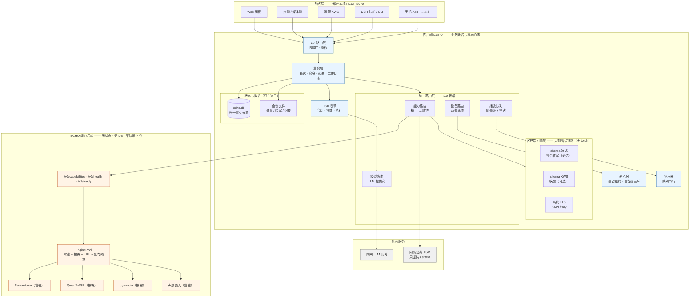
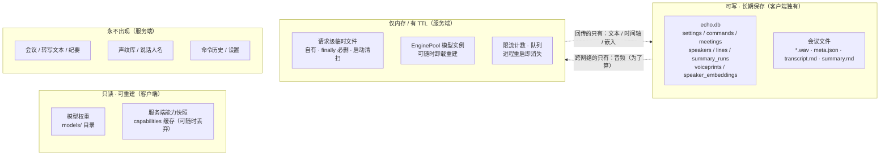
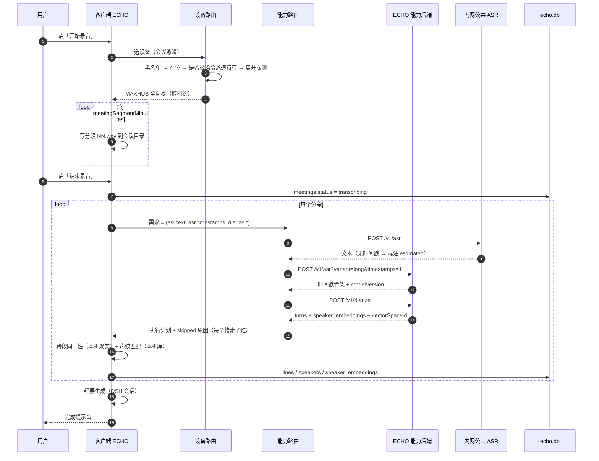
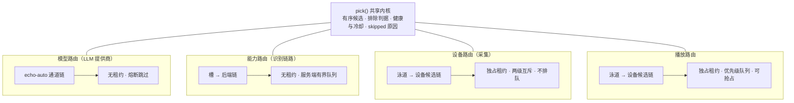
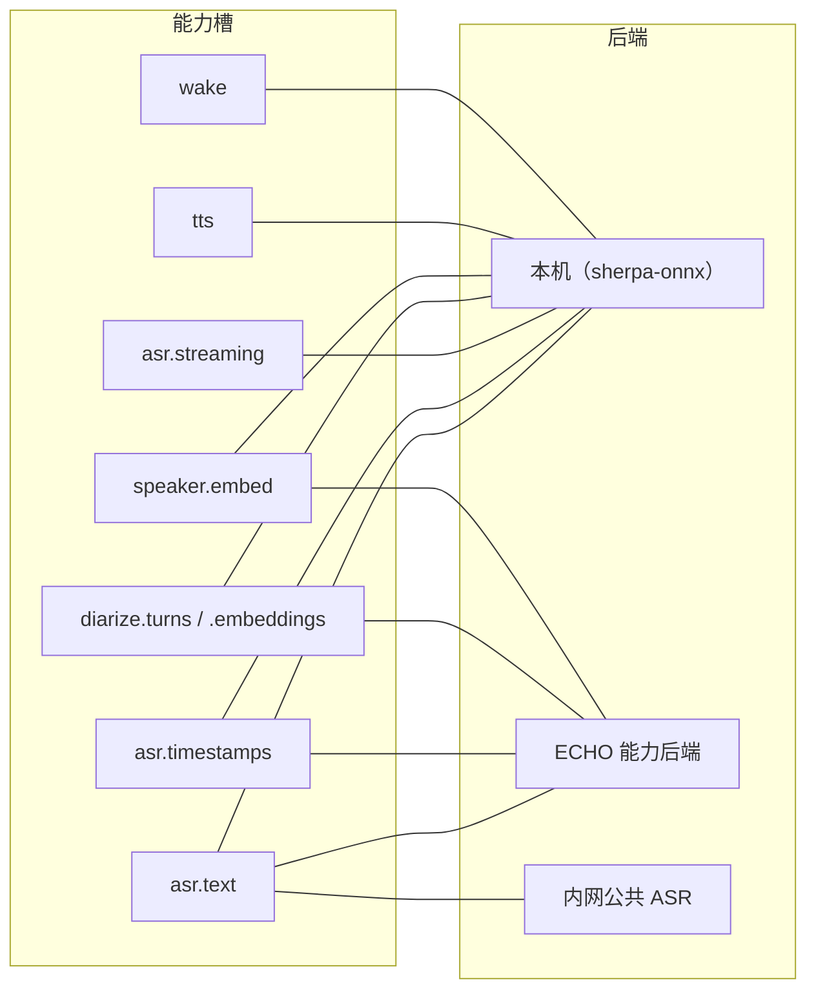
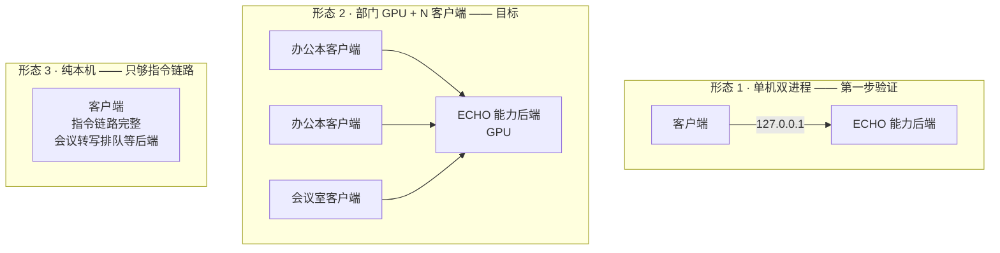
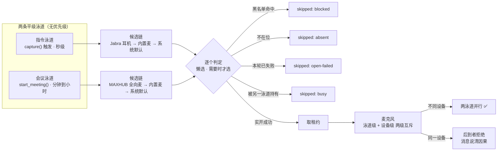
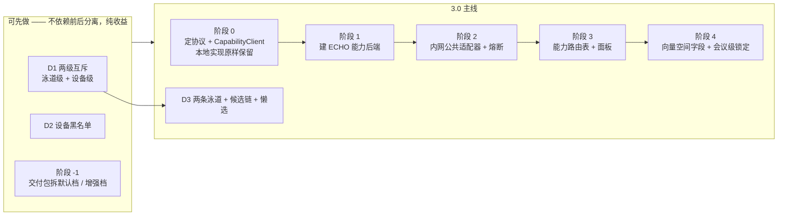

# ECHO 3.0 设计总览与组件关系

> 本文是四份设计文档的**收口**：一份总览、一组组件关系图、一次一致性对齐。
>
> | 分册 | 回答 |
> |---|---|
> | `docs/前后分离-能力服务化设计.md` | 切面原则：业务数据留客户端，服务端无状态 |
> | `docs/能力路由-三后端与轻客户端.md` | 本机 / ECHO 后端 / 内网公共 三后端 + 办公本安装预算 |
> | `docs/ECHO能力后端-服务端设计.md` | 服务端怎么建（EnginePool / 临时文件 / 错误码契约） |
> | `docs/统一路由-模型能力与设备.md` | 四域共享的选择内核 + 采集/播放设备 |
>
> **本文不重复细节，只做三件事**：总览、画图、对齐。

---

## 0. 一页速览

### 3.0 是什么

**一次架构分工的调整**：客户端持有业务数据与状态、保留轻量保底能力；
服务端只做无状态算力；两者之间用一套"按优先级选资源"的路由统一起来。

一句话：**算力外置，状态留内，能力可降级。**

### 2.0 → 3.0 的变化

| | 2.0（现状） | 3.0 |
|---|---|---|
| 进程形态 | 单进程单机 | 客户端 + 可选能力后端 |
| 重模型位置 | 全在本机（torch/pyannote/funasr） | 全部在能力后端；客户端只留 **torch-free 的指令链路**（会议不兜底） |
| 客户端安装 | 全量 > 8 GB | **默认档 ≈ 0.6 GB**（详见 §6） |
| 多机支持 | 无（API 预留） | 一服务端支撑多客户端 + 鉴权 + 配额 |
| 模型选择 | 全局单值设置 | **能力槽 → 后端链**，按槽分别选 |
| 设备选择 | 每泳道一个设备值 + 全局一把锁 | **两条泳道 + 有序候选链 + 设备级互斥** |
| 播放 | `sd.play()` 用默认输出 + 一把锁 | **设备候选链 + 优先级队列 + 可抢占** |
| 数据存储 | 单机 SQLite | **不变** —— 仍然只有客户端有业务数据 |

**3.0 不改的东西**：`echo.db` 仍是唯一事实来源；面板 / DSH / 技能 / 命令行仍走同一套 REST；
"触点统一"这个 2.0 的核心决策一个字都没动。

### 六条铁律（贯穿全部分册）

| # | 铁律 | 出处 |
|---|---|---|
| **L1** | 默认客户端 profile 不含 torch（也不含 CUDA、不含编译步骤） | 能力路由 §1 |
| **L2** | 产生向量的能力，只允许跑在能声明 `vectorSpaceId` 的后端上 | 能力路由 §3 |
| **L3** | 唤醒与指令转写必须有本机后端，不得依赖服务端可用性 | 前后分离 §3 |
| **L4** | 服务端不存储业务数据；临时文件允许，但必须**自有 + 可证明清理 + 有兜底** | 服务端 §1/§5 |
| **L5** | 同一场会议不得混用不同 `vectorSpaceId` 的说话人向量 | 前后分离 §6.3 |
| **L6** | **ECHO 安装目录里只允许放"可被整体覆盖"的东西**；数据、第三方组件状态、用户资产一律在外面 | 本文 §2.1 |

---

## 1. 组件关系总图



**看图要点**

1. **`ROUTE` 是 3.0 唯一新增的一整层。** 其余组件基本都在，只是职责被重新划线。
2. **业务数据只在 `CLIENT` 子图里**（`DB` + `MF`）。服务端子图里没有任何存储节点 —— 这是结构上保证的。
3. **`CAPR` 有三个出边**（本机引擎 / ECHO 后端 / 内网公共），这正是"三后端"的图形化。
   注意三个出边**指向不同能力**：本机**只服务指令链路**（会议不兜底）、ECHO 后端是全集、内网公共只有 `asr.text`。
4. **`DEVR` 与 `PLAYQ` 只在客户端内部** —— 设备是本机资源，永远不会成为一个能力槽。
5. **`LLMR` 在 `DSHE` 之下**，不在 `CAPR` 之下 —— 模型路由服务 DSH，能力路由服务识别链路，两者是并列的域（见 §4）。

---

## 2. 数据与状态归属



**这张图是 L4 的图形化。** 判定标准不是"这个数据重不重要"，而是**"它有没有跨请求累积"**：
有累积（会议、库、设置）→ 客户端；无累积且只为算（音频缓冲、模型实例）→ 可以过服务端。

**注意 `voiceprints` / `speaker_embeddings` 在 `W` 里，永远不在 `E` 或 `F` 的边界之外。**
声纹是敏感个人信息，它的处理只发生在客户端（匹配）+ 服务端（一次性提嵌入，算完即弃）。

### 2.1 目录与升级边界（"删掉 ECHO 重装，用户不该丢任何东西"）

#### 现状是坏的，而且根因只有一处

Windows 上 `app/platform/win32/env.py:16` 是 `"dataDir": "{ECHO}/data"` ——
于是**四样会累积的东西全在 ECHO 安装目录里**（macOS / Linux 反而是独立的，只有 Windows 不是）：

| 东西 | 现状落点（Windows） | 谁拥有 |
|---|---|---|
| ECHO 自己的状态（`echo.db` / logs / pid / token） | `<ECHO>\data\` | ECHO |
| 会议录音 / 转写 / 纪要 | `<ECHO>\data\meetings\` | **用户** |
| 模型权重 | `<ECHO>\models\`（`paths.models_root()` 缺省值） | 用户 |
| **DSH 标准版本体**（约 223 MB） | `<ECHO>\harness\dsh\` | **DSH** |
| **DSH 家目录**（skills / 会话 / 记忆 / `settings.yaml` / 凭据） | `<ECHO>\data\harness\`（`harnessHome` 留空 → `{DATA}/harness`） | **用户 + DSH** |
| ECHO 自带的安装技能源 | `<ECHO>\.dsh\skills\echo-install\` | ECHO |

`config.py:528` 把这件事写在了明面上：
*"安装技能会填成 `<安装目录>/harness/dsh` 里的本地入口"*。

**危害**：用户"删掉 ECHO 重装"或升级包覆盖时，会连带毁掉
模型（几 GB，重下代价大）、会议数据、以及**他在 DSH 里积累的 skills 与会话**。

#### 修正后的根划分

原则一句话：**ECHO 安装目录里只允许放"能被整体覆盖"的东西。**

| 根 | 放什么 | 谁拥有 | 升级时 | 默认值（Win） |
|---|---|---|---|---|
| `{ECHO}` | 代码 + 面板静态资源 + 随包脚本 | ECHO | **覆盖** | 安装目录 |
| `{RUNTIME}` | Python 运行时 | ECHO | 覆盖但保留 | 独立 |
| `{DATA}` | ECHO 自己的状态 | ECHO | **保留** | **`%LOCALAPPDATA%\ECHO`** ← 改这里 |
| `{MEETINGS}` | 会议录音 / 转写 / 纪要 | 用户 | **保留** | `{DATA}\meetings`（自动跟着独立） |
| `{MODELS}` | 模型权重 | 用户 | **保留** | `{DATA}\models` ← 也要挪出 `{ECHO}` |
| **`{DSH_INSTALL}`** | DSH 标准版本体 | **DSH** | **保留** | `%LOCALAPPDATA%\DeepSeekHarness\app` |
| **`{DSH_HOME}`** | skills / 会话 / 记忆 / 设置 / 凭据 | **用户 + DSH** | **绝对保留** | `%LOCALAPPDATA%\DeepSeekHarness\home` |

**关键推论：改 `dataDir` 一处，`{DATA}` / `{MEETINGS}` 两样自动就独立了** ——
因为后者的缺省值本来就挂在 `{DATA}` 下（`paths.meetings_root()`）。
剩下只需单独挪 `{MODELS}` 和两个 DSH 根。

#### 为什么 DSH 的两个根要**用 DSH 的名字**，而不是 ECHO 的名字

`%LOCALAPPDATA%\DeepSeekHarness\` 而不是 `%LOCALAPPDATA%\ECHO\dsh\` —— 这不是洁癖：

1. **DSH 是独立产品。** 用户会直接用它的 Web 界面（面板上就有「用浏览器打开标准版」）。
   他的 skills / 会话 / 记忆是**在 DSH 里积累的资产**，不是 ECHO 的子数据。
2. **双向写入。** 用户自己往 DSH 装 skill，ECHO 也装 skill（`echo-install`）。
   两个来源共用一个 home，不能有谁"拥有"它。
3. **目录名就是所有权声明。** 放在 ECHO 名下，下一次"清理 ECHO 目录"就会误删。

> **待确认**：DSH 标准版**自己**的默认家目录是什么？如果它有既定约定，
> 应当**优先跟随它**，ECHO 只在用户显式配置时覆盖。这一条我不能凭猜——需要实测或问 DSH 侧。

#### 迁移策略（老装机上 `{ECHO}\data` 已有数据）

- **新装** → 直接用新位置
- **老装** → 检测到 `{ECHO}/data` 存在 → 面板提示 + **一键迁移**，**不自动搬**
  （几 GB 的会议录音与模型，移动有失败风险；`/api/paths/migrate-meetings` 已有现成先例）
- **迁移期间** → 新位置优先，老位置**只读兼容**
- 迁移完不删老目录，让用户自己确认后再删

#### 建议的两条铁律 + 护栏测试

> **L6：ECHO 安装目录里只允许出现"可被整体覆盖"的东西。**
> 判据（也是最直白的验收）：**"删掉整个 ECHO 目录重装，用户会丢什么？"**
> 答案必须是"**什么都没丢**"。

| 测试 | 断言 |
|---|---|
| `test_echo_root_holds_only_code.py` | `{ECHO}` 下的顶层条目全在白名单内（`app/ web/ scripts/ plugin/ docs/ assets/` + 少数随包脚本） |
| `test_roots_are_outside_echo.py` | `data_root()` / `meetings_root()` / `models_root()` / DSH 两个根的**默认值都不在 `echo_root()` 之下** |
| `test_dsh_home_never_under_echo.py` | `harness_home()` 解析结果不得落在 `{ECHO}` 内（显式配置成 ECHO 下时**拒绝并报错**，不是静默接受） |
| `test_skills_ownership.py` | ECHO 只更新自己装的 skill（靠 `skills/.echo-managed` 清单），**不删用户自己装的** |

最后一条是针对一个真实的坑：`skills/` 是 ECHO 与用户**共享**的目录。
没有所有权标记的话，升级时的"清理旧版本 skill"会误删用户自己的。

### 2.2 安装根目录：`{ECHO_BASE}` 与它的兄弟目录

> **2026-09-24 晚：拍板并按此实现（用户定稿）**。与下面这份 9-23 提案的三处差别：
> ① 第四个兄弟目录叫 **`aide`**（不叫 `command`）；
> ② `dsh/` 里**再分两处**：`dsh/app`（本体）+ `dsh/home`（DSH_HOME）；
> ③ `meeting`/`aide` **同时**是数据目录与 DSH 工作区（两项设置合并/强制联动）。
> 代码侧已落地：`app/paths.py`（`echo_base()` + 六个兄弟目录 + `meeting_space_root()`）、
> `app/workspaces.py`、`app/harness_proc.py`（本体与家目录）、`app/modelinfo.py`（HF_HOME）。
> **还没做**：`install.ps1` 与启动脚本那一层（它们仍假设"代码根 = 数据根 = 安装根"）、
> 交付包、老装机迁移、以及下面 §2.2 末尾那两个待拍板的点（venv 落点、agent 默认 cwd）。

**提案**（2026-09-23）：安装时问用户一个根目录，下面分几个兄弟目录：

```
{ECHO_BASE}/                  ← 安装时设定
├── echo-core/    ECHO 代码 + 面板 + 随包脚本       → 升级**整体覆盖**
├── data/         echo.db / logs / pid / token     → 必须保留   ★补
├── models/       模型权重（几 GB）                 → 必须保留   ★补
├── dsh/          DSH 标准版本体（+ DSH 家目录？）   → 必须保留
├── meeting/      会议数据 **并**作「会议空间」工作区 → 必须保留
└── aide/         指令数据（+ skills？）**并**作「指令空间」工作区 → 必须保留
```

#### 为什么要补 `data/` 与 `models/`

提案里只列了四个。缺的两项不是可选的：

- **`data/`（ECHO 自己的状态）不能塞进 `echo-core/`** —— 那是"可被整体覆盖"的目录，
  `echo.db` 会被升级冲掉（直接违反 L6）。它也不属于 meeting / aide / dsh 任何一类。
- **`models/`（几 GB）同样不属于那四类**，而且用户很可能想把它放到**另一个盘**
  （大盘/慢盘放大模型，小 SSD 放程序）。所以缺省挂在根下，但**必须允许单独覆盖**。

#### 这一步顺带修掉一个真实 bug

现状 `config.py` 里是**两条独立设置**，而且 `config.py:441-443` 的说明明确强调它们"不是一个东西"：

| 设置 | 现值 | 含义 |
|---|---|---|
| `meetingsDir` | `""` → `{DATA}/meetings` | 录音/纪要**文件**放哪 |
| `meetingWorkspace` | `{ECHO}/data/meetings` | DSH **会话**登记到哪个工作区 |

**它们今天恰好指向同一个目录**（Windows 上 `{DATA}` = `{ECHO}/data`）——
但那是巧合，不是约束。用户一旦按说明去改 `meetingsDir`（搬家会议数据是常见诉求），
DSH 工作区仍停在老路径 → **DSH 就看不到会议文件了，而且没有任何地方会报错。**

提案把它定成一条规则：**`meeting/` 同时是数据目录与工作区**。
所以 3.0 应当**合并这两项**（或强制联动），让"两条路到达同一目录"**从巧合变成不变量**。

#### 设置项收敛

| 设置 | 作用 | 缺省 |
|---|---|---|
| **`echoBase`**（新） | 安装根。**只在安装时写**；运行时改它 = 触发迁移 | 安装时问用户 |
| `{ECHO}` | 代码根 | `{echoBase}/echo-core` |
| `{DATA}` | ECHO 状态 | `{echoBase}/data` |
| `{MODELS}` | 模型权重 | `{echoBase}/models` |
| `dshInstall`（新） | DSH 本体 | `{echoBase}/dsh/app` |
| `meetingWorkspace` **≡** `meetingsDir` | 会议空间（**并成一项**） | `{echoBase}/meeting` |
| `commandWorkspace` | 指令空间 | `{echoBase}/aide` |

**根只是缺省，每一项仍允许独立覆盖** —— 模型与录音的体积特性不同，分盘是合理需求。

#### 已经落地的一半：`app/workspaces.py`

这个模块已经存在，而且做的正是"目录 → DSH 工作区"这件事（`ensure_spaces()`）：
建目录 → `workspace/create` 拿 id → `workspace/rename` 改成中文名。
`meetingWorkspace` / `commandWorkspace` + 两个 `Title` 设置、`/api/dsh/workspaces/ensure`、
`boot.py` 的兜底重试都已就位。**所以这个提案不需要新建机制，只需把根引进去、并调缺省值。**

它同时提示了一条 DSH 的硬约束（做设计时别忘）：
**侧栏分组是"显式登记制"，只有用 `workspaceId` 建会话才会归组**（传 `cwd` 只建目录不登记，
会话落到「未分组」）。而且 `workspace/create` 只收目录、分组名由目录名派生 ——
所以"建成「会议空间」"必须是**三步**，缺一步用户看到的就是"没分组"或"分组名是 meeting"。

#### 一个要拍板的点：`DSH_HOME` 放哪

"aide 装 skill"这句需要澄清一个事实：**skills 在 DSH 家目录的 `skills/` 下，不在工作区里。**
而 DSH 家目录同时装着 `storages/`（含 `workspace.json`）、会话、`settings.yaml`、`.credentials.yaml`。

| 方案 | `DSH_HOME` | 好处 | 代价 |
|---|---|---|---|
| **A** | `{echoBase}/dsh/home` | DSH 自己的存储与工作区**不混** | `aide/` 里看不到 skills，与"aide 装 skill"的说法不符 |
| **B** | `{echoBase}/aide` | 与提案说法一致：`aide/skills/` 与工作区文件同在一处 | **DSH 会把自己的会话存储当成工作区内容** —— `aide/storages/` 是 agent 自己的存档，工作区里的 agent 能读到它，可能被索引成噪音 |

**倾向 A**：B 有一个真实的自引用问题。
若确实要 B，建议把 DSH 的状态放进隐藏子目录并在面板标注"别手删"。

#### 迁移（老装机）

| 老位置 | 新位置 |
|---|---|
| `D:\ECHO\{app,web,scripts,plugin,docs,assets}` | `{base}\echo-core\` |
| `D:\ECHO\data\` | `{base}\data\` |
| `D:\ECHO\data\meetings\` | `{base}\meeting\` |
| `D:\ECHO\data\command\` | `{base}\aide\` |
| `D:\ECHO\models\` | `{base}\models\` |
| `D:\ECHO\harness\dsh\` | `{base}\dsh\app\` |
| `D:\ECHO\data\harness\` | `{base}\dsh\home\`（或 `aide\`，待定） |

策略与 §2.1 一致：**不自动搬**（几 GB）、面板提示 + 一键迁移、老位置只读兼容一个版本。

#### 安装向导要加的一步

- 问根目录；建议 `D:\ECHO`（沿用现状习惯）或 `%LOCALAPPDATA%\ECHO`
- 校验**直接复用 `paths.validate_dir()`** —— 它已经具备：绝对路径、拒绝磁盘根 / 系统目录、
  可写探针（"建了就删"），不用新写
- 再加一条**空间检查**：模型 + 会议录音可能几十 GB，装之前就要提示可用空间

---

## 3. 一次会议转写的完整链路



**三个要点**

1. **`asr.text` 走了内网公共、`asr.timestamps` 与 `diarize` 走了 ECHO 后端** ——
   这是"槽级拼装"的实例，也是 `_fallback_sv_rows()` 一般化后的样子。
2. **`diarize` 之后客户端还要做一次本机计算**（跨段同一性 + 声纹匹配）——
   这是整个设计里最容易被忽略的一步：服务端只出"段内结果 + 嵌入"，跨段身份是客户端的事。
3. **`vectorSpaceId` 随每次 diarize 响应回来**，客户端据此做会议级锁定（L5）。

---

## 4. 四个路由域的对齐



| | 模型路由 | 能力路由 | 采集设备 | 播放设备 |
|---|---|---|---|---|
| **候选** | 通道 | 后端（本机/ECHO/内网） | 设备链（2 泳道） | 设备链 |
| **租约** | 无 | 无 | **独占（跨泳道设备级互斥）** | 独占 |
| **排队** | 否 | 服务端有界队列 | **否 —— 快速失败** | **是 —— 优先级 + 可抢占** |
| **状态** | 内网网关已就绪 | 新增 | 新增 | 新增 |
| **实现** | `dsh-failover/proxy.py`（独立进程） | `app/capabilities/` | `mic.py` 改造 | `app/audio/playback.py` |

**共用的只有 `pick()` 内核**，租约与队列各自实现。
强行合并（例如把设备塞进 `EnginePool`）会把两个本质不同的东西套进一个抽象：
池管的是"可共享的模型实例"，设备是"独占句柄"。

---

## 5. 能力槽 × 后端矩阵

权威清单以 `docs/能力路由-三后端与轻客户端.md` §4.2 为准。



| 槽 | 本机 | ECHO 后端 | 内网公共 | 说明 |
|---|---|---|---|---|
| `asr.text`（指令） | ✅ **锁定** | ⚠️ 仅增强（默认关） | ❌ | L3：可用性归本机 |
| `asr.text`（会议） | ❌ **不兜底** | ✅ | ✅ 优先（质量） | 会议链路 100% 依赖后端 |
| `asr.timestamps` | ❌ **不兜底** | ✅ | ❌ 通常无 | 无时间戳时退回按字数均摊并标 `estimated` |
| `asr.streaming` | ✅ | ❌ | ❌ | 流式必须本机（指令专用） |
| `diarize.*` | ❌ **不兜底** | ✅ 唯一 | ❌ **永久排除**（L2） | |
| `speaker.embed` | ❌ **不兜底** | ✅ 唯一 | ❌ **永久排除**（L2） | 嵌入由后端提取；**库仍在客户端**，详见 §5.1 |
| `tts` | ✅ 系统自带 | ⚠️ 可选 | ❌ | |
| `wake` | ✅ 唯一 | ❌ | ❌ | 是能力槽，但**不是设备泳道**（见 §7） |

### 5.1 声纹：它不跟着"会议不兜底"一起砍掉

用户 2026-09-23 特别点名：*"不要默认会议本地转写，**但是还要考虑声纹功能**"*。
这两件事看着都在会议链路上，但**约束条件完全不同**，不能一刀切：

| | 会议转写 | 声纹 |
|---|---|---|
| 数据量 | 几十分钟音频（几十 MB / 场） | **秒级音频**（现场注册）；会议侧复用已有嵌入 |
| 对延迟 | 可延迟（排队可接受） | 注册要即时反馈 |
| 隐私等级 | 会议内容 | **敏感个人信息**（生物特征） |
| 库在哪 | — | **必须留在客户端**（不变） |

#### 一个反直觉的结论：声纹"出机"在 3.0 下**不新增任何暴露面**

早前的原则写过"生物特征不出内网"。但要注意：

> **会议音频本来就要上行做转写。** 从同一份音频里提声纹嵌入，
> 并不比"把这段音频送去转写"多泄露一个字节。

所以"为了声纹隐私而保留客户端本地 embedding"这个理由，**在会议链路里站不住**。
唯一真正新增的暴露面是**现场注册**（对着麦克风说一句话）—— 那段音频原本不必出机。

#### 因此声纹的形态：功能全保留，实现跟着链路走

| 环节 | 放哪 | 变化 |
|---|---|---|
| 提嵌入（会议说话人） | **服务端**（`/v1/diarize` 已返回 `speaker_embeddings`） | 无额外成本 —— 复用 diarize 的产物 |
| 提嵌入（现场注册） | **服务端** `/v1/speaker/embed`（新增端点） | 几秒音频上行；可选"仅本地"降级 |
| 余弦匹配 + 阈值 + 间隔门 | **客户端**（`VoiceMatcher`） | 不变 |
| 声纹库 / 入库 / 改名 / 删除 / 合并 | **客户端**（`voiceprints` 表） | 不变 |
| 「识别本场」 | **客户端**（用已落库的嵌入） | 不变 |

**所以 `vectorSpaceId` 仍然只有一个来源** —— §5.1.1 的简化（客户端不产生向量）**成立**。

#### 三件必须补上的事（现在是缺的）

1. **`vector_space_id` 落库。** `speaker_embeddings` 与 `voiceprints` 现在只有 `embedding` + `dim`
   （`voiceprint.pack()` 返回 `(blob, dim)`）。换服务端 embedding 模型后，旧样本与新嵌入的余弦
   **会静默变成噪声** —— 不报错，只是开始认错人。这是这套设计里唯一会**不报错地出错**的地方。
2. **现场注册功能目前不存在。** `voiceprint.py` 只有 `enroll_from_meeting()` ——
   入库的唯一路径是"在会议里把说话人改名为联系人"。有了 `/v1/speaker/embed`
   才能做"念一段话就注册"，门槛会低很多，也才配得上"声纹库"这个名字。
3. **"换模型 = 全库失效"的迁移流程。** 服务端换 embedding 模型时要有：
   面板提示 + 「用新模型重新入库」+ 旧样本**保留不删**（只标为旧空间、不参与匹配）。

#### 一个必须守住的不变量

**注册与识别必须同一向量空间。**

如果将来允许"本机注册"（`sherpa-onnx` 的 `SpeakerEmbeddingExtractor`，模型只几十 MB），
就必须让**服务端也用同一个模型** —— 否则本机注册的样本与会议里认出的嵌入**不可比**。

这正是 `docs/能力路由-三后端与轻客户端.md` §0.1 里"同权重不同运行时"那个假设要回答的问题。
**在那条被实测验证之前，"注册与识别都走服务端"是唯一不会错的选择。**

> 反过来说：如果实测证明"同权重、两边向量可比"，那么本机注册就能白拿
> （几十 MB 模型 + 声纹音频完全不出机）。**这是一条投入很小、收益明确的实测**，
> 建议保留在待办里（与 §12 里被取消的那几件区分开）。

---

## 6. 部署形态



**形态 1 / 2 必须都支持**；形态 3 的意义是"服务端没建好时，**指令链路仍然完整可用**"，
**不是**"会议也能凑合转写"（见下）。

| 形态 | 客户端重量 | 会议转写 | 说话人/声纹 |
|---|---|---|---|
| 1 | 轻（无 torch） | 服务端 | 服务端 |
| 2 | 轻（无 torch） | 服务端 | 服务端 |
| 3 | 轻（无 torch） | **排队等后端**（无本机兜底） | 不可用（不兜底） |

**默认档客户端体积预算**（详见能力路由 §1）：

```
必选：  运行时核心 155  +  本机流式 ASR 模型 189  +  ECHO 代码 3   ≈ 350 MB
可选：  KWS 唤醒模型 40
后装：  DSH 标准版 ~223 MB（装完在面板点一下装）
不装：  会议转写 / 说话人分离 / 声纹的任何模型（会议明确不做本机兜底）
```

### 6.1 客户端组件清单（必选 / 后装 / 可选）

"必选"要分两个维度看，混在一起最容易漏东西：

- **功能必选** —— 没有它，ECHO 的核心链路断了
- **包内必含** —— 安装时就必须在包里（其余可以装完再从面板补）

| 组件 | 功能必选 | 包内必含 | 说明 |
|---|---|---|---|
| `runtime-core`（Python 运行时 + 基础依赖） | ✅ | ✅ | 现在 `components.REQUIRED_IDS` 里**唯一**的一项 |
| **本机流式 ASR 引擎 + 模型**（sherpa-onnx + zipformer） | ✅ | ✅ | **铁律 L3**：指令转写不得依赖服务端可用性。漏了它，症状就是"服务端一挂、按热键没反应" |
| ECHO 代码 + 面板静态文件 | ✅ | ✅ | 含仪表盘 / 会议 / 指令历史 / 设置 / 路由 / 组件页 |
| **业务数据存储**（`echo.db` + 会议文件目录） | ✅ | — | 不是"组件"，是运行时产物；但它是"业务数据留客户端"的落点 |
| **采集与播报**（麦克风租约 + 播放队列 + 热键/媒体键） | ✅ | ✅ | 客户端独有，服务端没有 |
| **智能体后端 = DSH 标准版（唯一）** | ✅ | ⚠️ **后装** | `assistant._dispatch()` 里 `client.ping()` 失败就直接 `DSH 未运行，命令未发送`。3.0 起退役桌面版与 CodeBuddy（见 §6.2） |
| DSH 技能目录（`.dsh/skills/`，含 `echo-install`） | ⚠️ | ✅ | 装 / 修 DSH 靠它；没有它就只能手工装 |
| TTS 离线音色（SAPI / `say` / espeak） | ✅ | — | 系统自带，零依赖 |
| 唤醒 KWS（模型 40 MB） | ❌ | ❌ | 设置里默认关闭，属"可选功能" |
| 离线会议转写模型（sherpa 离线 / SenseVoice / whisper / Qwen3-ASR） | ❌ | ❌ | **明确不做本机兜底**（2026-09-23 决定）：会议链路 100% 依赖能力后端 |
| 说话人分离 / 声纹模型 | ❌ | ❌ | 嵌入由后端提取（`/v1/diarize`、`/v1/speaker/embed`）；**声纹库仍在客户端**（见 §5.1） |
| CUDA 加速（`accel-cuda`） | ❌ | ❌ | 客户端**刻意不装**（L1：默认档不含 torch / CUDA） |
| 在线 TTS（edge-tts） | ❌ | — | 纯 Python，无模型；离线用系统自带音色 |

**三条容易搞错的**：

1. **智能体后端是功能必选，但不该进包。** 它要联网（npm 584 包 / 约 2 分钟）、会失败；
   把它的失败面关在主安装流程里，是"3 分钟装完"的前提 → 装完在面板点一下装（见 §9）。
2. **服务端不是"必装件"，但是会议链路的硬依赖。** 客户端能独立启动（形态 3），
   指令链路完全不受影响；但**会议转写没有本机兜底，后端不可达就只能排队**。
   安装引导里必须说清"会议转写需要能力服务端"，否则用户会以为"录完就自动出纪要"。
3. **本机 ASR 引擎最容易被漏掉**，因为它不像模型那样显眼（它是一个 pip 依赖 + 一个模型目录）。
   漏掉它的后果，正是 L3 要防的那件事 —— **注意它是给指令链路兜底的，与会议无关**。

### 6.2 智能体后端收敛到 DSH 标准版（唯一）

**决策**：3.0 起客户端只保留 **DSH 标准版 harness**，退役 **DSH 桌面版**与 **CodeBuddy**。

#### 消掉的复杂度（按代码实测清点）

| 位置 | 现状 | 收敛后 |
|---|---|---|
| `app/agents/dsh_agent.py`（34 KB） | DSH Desktop 适配器（HTTP JSON-RPC `:43120`） | 退役 |
| `app/agents/codebuddy.py`（13 KB） | CodeBuddy CLI 适配器 | 退役 |
| `app/config.py:498` `agentBackend` | 三选一（`dsh`/`codebuddy`/`harness`） | 常量化 / 退役 |
| `app/config.py:502` `agentCodebuddyEnabled` | — | 退役 |
| `app/components.py:72` `agent-dsh` | 面板上的一张卡 | 退役 |
| `platform/{win32,darwin,linux}/env.py` `codebuddy_cli_candidates()` | 三个平台各一份 | 退役 |
| `agents/__init__.py::_log_fallback()` | 智能体之间自动降级 | 没有降级对象了 |
| `llm_router.dsh_homes()` + `router_admin` + `worklog.py` | 遍历**多个**家目录 | 收敛为单一家目录 |
| `harness_proc.requested()`（`:142`） | `agentBackend=="harness"` **且** `agentHarnessEnabled` | 只剩启用开关 |
| `app/api.py:165` 智能体探测特例 | "codebuddy 那种每次起进程的适配器" | 探测变轻 |

最后一行顺手消掉了 `AGENTS.md` 里记的一个**真实 bug**：
"切走智能体时只改 `agentBackend`，于是 node 进程一直挂着（`43199` 仍在监听）" —— 没有"切走"这回事了。

#### 面板要补的（因为变成了单点）

现在智能体区是**两张卡、二选一**；收敛后只剩一条，但它是**唯一**路径，所以必须更完整：

- 安装 / **修复** / 升级 —— `harness-install-local.{ps1,sh}` 已支持"修装坏的标准版"
- 查看日志（`data/logs/harness.log`）
- 重启 / 停止 —— `harness_proc.stop(reason=…)` 已会留痕
- token 状态 + 「用浏览器打开」

#### 必须写清的降级边界（单点风险）

| 链路 | DSH 标准版挂了会怎样 |
|---|---|
| **语音指令执行** | **断** —— `assistant._dispatch()` 直接失败（"DSH 未运行，命令未发送"） |
| **会议纪要** | **不断** —— 有**直连 LLM 兜底**：`meeting.direct_llm_decision()` 在"agent 不可用但 LLM provider 就绪"时走直连（P5 的承诺："不装 agent 也能出纪要"） |
| 会议转写 / 说话人 / 声纹 | 不受影响（走能力路由，与智能体无关） |
| 仪表盘 / 设置 / 历史 / 路由 | 不受影响 |

**所以"收敛"不等于"裸奔"**：纪要仍有第二条路，但**指令执行没有** —— 这句要出现在面板的提示语里。

#### 两个执行建议

1. **`dsh_homes()` 先别删**，把语义收窄为「标准版家目录 + 已存在的历史家目录（只读）」。
   理由：已装机上可能还留着桌面版家目录；而 `test_dsh_home_coupling.py` 那条
   "不许把家目录写死成 `~/.dsh`"的铁律依然正确。**等一个版本之后再删。**
2. **`test_dsh_multi_home.py`（22 KB）要重写**：它钉的是"四种装法"
   （只有桌面版 / 只有标准版 / 都有 / 都没有），收敛后其中三种失去意义，
   改成"只有标准版 / 家目录不存在"两态即可。`test_dsh_home_coupling.py` 保留不动。

### 6.3 客户端最小安装范围（含要改的具体文件）

**一句话**：最小档 = **Python 运行时（含 sherpa-onnx）+ sherpa 流式模型 + ECHO 代码 ≈ 374 MB**，
**零联网下载**；DSH 标准版 223 MB **后装**。

#### 清单

| 项 | 实测 / 声明 | 进包 | 说明 |
|---|---|---|---|
| `runtime-core`（uv CPython 3.11 + 基础依赖 + **sherpa-onnx**） | 155 + 27.4 ≈ **182 MB** | ✅ | 见下"必须先修的缺口" |
| `stt-sherpa`（流式 zipformer 模型） | **189.3 MB** | ✅ | **L3 的落点**，必须从"可选"升为"必装" |
| ECHO 代码 + 面板静态资源 | **~3 MB** | ✅ | `app/ web/ scripts/ plugin/ docs/ assets/` |
| 系统 TTS | **0** | — | SAPI / `say` / espeak，系统自带 |
| **小计（装完即可开面板 + 指令链路可用）** | **≈ 374 MB** | | |
| DSH 标准版（唯一智能体后端） | ~223 MB | ❌ **后装** | 面板点一下装；装完指令可执行、纪要可生成 |
| `wake-kws`（唤醒模型） | 39.7 MB | ❌ 可选 | 设置里默认关 |

#### ⚠️ 必须先修的缺口：按现在的清单，最小档**跑不起来指令转写**

四处对不上（这是 L3 落地时最容易漏的地方）：

| 位置 | 现状 | 问题 |
|---|---|---|
| `requirements-core.txt` | 11 个基础包，**没有 `sherpa-onnx`** | 装了模型也没有引擎 |
| `components.py:105` `stt-sherpa` | `optional=True, required=False` | 最小档**不会**装它 |
| `components.py:34` `REQUIRED_IDS` | 只有 `("runtime-core",)` | 同上 |
| `components.py:61-64` `runtime-core` | `purpose` 写"faster-whisper / funasr / sherpa-onnx"、`detect` 查这三个 | 而它实际装的 `requirements-core.txt` **一个都没有** → 这条的就绪判定一直在问它不装的包 |

**要改的三处（都很小）**：

1. `requirements-core.txt` += `sherpa-onnx>=1.10`
2. `components.py`：`stt-sherpa` 由 `optional=True` 改为必装
3. `components.py`：`REQUIRED_IDS` → `("runtime-core", "stt-sherpa")`，
   并把 `runtime-core` 的 `purpose` / `detect` 改成与 `requirements-core.txt` **一致**

#### 明确**不进**客户端的

| 不装 | 省下 |
|---|---|
| torch + nvidia（CUDA 运行时） | 4.3 GB + 914 MB |
| ctranslate2（捆 cuBLAS） | 795 MB |
| SenseVoice 模型 | 896.5 MB |
| Qwen3-ASR + ForcedAligner | ~3.6 GB |
| faster-whisper 各档 | 141 / 464 / 1460 / 2948 MB |
| pyannote 三件套 | 31.4 MB（但依赖 torch，所以一起省掉） |

**对照本次实测的现状**：`models/` **8187.6 MB** + torch/nvidia **约 5.2 GB** ≈ **13.1 GB**。
最小核心 **374 MB** —— 约 **1/35**。

#### 最小档装完能做什么

| 能力 | 最小档 | 备注 |
|---|---|---|
| 面板 / 设置 / 历史 / 路由 / 组件管理 | ✅ | |
| 语音指令：**转写** | ✅ | 本机 sherpa，L3 |
| 语音指令：**执行** | ⚠️ **需要 DSH** | 后装；没有它 `_dispatch()` 直接失败 |
| 会议**录音** | ✅ | 本机，不依赖后端 |
| 会议**转写** | ❌ **需要能力后端** | 无后端时**排队**（§12） |
| 说话人分离 / 声纹嵌入提取 | ❌ **需要能力后端** | |
| 声纹**匹配 / 库管理** | ✅ | 匹配在客户端；但要有嵌入才用得上 |
| 纪要生成 | ⚠️ 需要 DSH **且**已转写 | |
| 唤醒 | ⚠️ 需装 KWS | 默认关 |

#### 安装步骤（四步，第 2 步零联网）

1. 选安装根 `{echoBase}`（§2.2）
2. 解包 → **面板可用、指令转写可用**（不联网、不下模型）
3. 面板点一下装 **DSH 标准版**（联网，约 2 分钟）→ 指令可执行、纪要可生成
4. （组织级）配**能力后端地址** → 会议转写 / 说话人 / 声纹嵌入可用

### 6.4 已经装过 DSH 的用户怎么办

**核心政策：先发现，再沿用。不重装、不覆盖、不删除。**

#### 五种情形，逐条给政策

| 情形 | 怎么检测（现成手段） | 政策 |
|---|---|---|
| **A. 已在 ECHO 目录下装过标准版**（`{ECHO}\harness\dsh`） | `harness_proc.local_entry()` 已经在查 `LOCAL_ENTRY_REL` | **移动**到 `{echoBase}/dsh/app`，**不重新下载**（223 MB → 同盘移动是秒级） |
| **B. 自己装了标准版，并配了 `harnessCommand`** | `harnessCommand` ≠ 出厂值 | **一个字都不动**。现有政策已如此，3.0 必须保留 |
| **C. 已有 DSH 家目录**（skills / 会话 / 记忆 / 凭据） | `llm_router.dsh_homes()` —— 判据是目录里有 `settings.yaml`，**已经现成** | **列出让用户选**；**什么都没找到时也要问一句**；**确认没有才新建**（完整流程见下） |
| **D. 已装 DSH 桌面版** | `dsh_homes()` 里的 `HOME_DESKTOP`（`$DSH_HOME` 或 `~/.dsh`） | **本体不碰**；只问一件事：**技能导过来，还是分开试用**（两个选项都可逆） |
| **E. 版本与 ECHO 期望的不一致** | `harness-install-local.{ps1,sh}` 已会比较并**明确告警**（"仍可用，不完全掩盖"） | 保留告警；**发现已装版本比期望的新时，不要降级它** —— 告警"ECHO 可能与它不兼容"更诚实 |

#### 最关键的一条：别让用户看到**空的技能列表**

现状会这样发生 —— `harness_proc.home()` **永远返回一个值**，`ensure_running()` 里强塞环境变量：

```python
dsh_home = home()                   # harnessHome 或 {DATA}/harness，永不为空
env["DSH_HOME"] = dsh_home          # 注释原文："独立家目录：不碰 Desktop 的家"
```

所以如果用户的技能/会话在 `~/.dsh`（桌面版惯例），ECHO 拉起的标准版会用
`{DATA}/harness` → **他在 ECHO 面板里看到的技能列表是空的**，而他的那份资产在别处，
两边互不知情。这就是"用户已经装了 DSH"最糟的体验。

**3.0 改成"先检测 → 列出 / 追问 → 确认 → 才装"**。放在**面板点「安装标准版」这个动作里**
（不是 ECHO 主安装包 —— 那时 DSH 还没装，问了也没用）：

```
① 检测（不改任何东西）
   llm_router.dsh_homes()        → 家目录（判据：有 settings.yaml）
   harness_proc.local_entry()    → 本体（判据：bin.js 非空）
   另外看一眼"目录存在但没有 settings.yaml"（装过但没运行过）

② 分支
   ┌ 找到 N 个 → 列出全部：路径 / 类型(桌面版|标准版) / 技能数 / 会话数 / 最后使用
   │            让用户选一个作为 ECHO 用的，或选「新建」
   └ 什么都没找到 → **仍然问一句**："你之前装过 DSH 吗？装在哪？"
                   给一个路径输入框（检测覆盖不全时让他指路）
                     ├ 用户指了路径 → 回到 ② 按"找到"处理
                     └ 用户确认「没有」 → 才走新建
③ 按选中的类型决定后续问题
   · 选中「标准版」家目录 → 直接沿用（写 harnessHome），**不再多问**
   · 选中「桌面版」家目录 → **再问一句**：
       「要把桌面版的技能导入新的标准版，还是分开试用？」
         ├ 导入     → 新建标准版家目录 + 复制 skills/
         └ 分开试用 → 新建标准版家目录（空的），**桌面版原样不动**
④ 确认之后才做实际动作
   · 沿用 → 只写 harnessHome
   · 导入 / 分开试用 → 建 {echoBase}/dsh/home，再跑 harness-install-local 装本体
```

**为什么"什么都没找到"也要问一句**：`dsh_homes()` 的判据是 `settings.yaml`，
而**装过但从未运行过的 DSH 没有这个文件** —— 检测必然漏。问一句是最便宜的兜底，
也正是"不静默"原则的落点。

**"导入"与"分开试用"的语义边界**（2026-09-23 定：**只搬技能 + 大模型配置**）

| | 导入 | 分开试用 |
|---|---|---|
| **技能** | **复制**到标准版家目录 | 不复制，留在桌面版 |
| **大模型配置** | **合并**（见下） | 不合并 |
| 凭据（API key） | **单独问一句**（见下） | 不搬 |
| 桌面版本体与家目录 | 原样不动 | 原样不动 |
| **会话 / 记忆** | **不搬**（你不搬也对：跨版本格式风险高，坏了用户无从判断） | 不搬 |
| 面板上 | 标准版里立刻能看到那些技能与模型 | 都是空的，**并明说为什么** |

**三件要分开处理，不能当成"复制一个目录"**

**① 技能** —— 直接复制 + 冲突处理（接上 `skills/` 的所有权机制，见下）。

**② 大模型配置** —— **必须"合并"，不能"覆盖"。** 两个原因：

- `settings.yaml` 是**整个文件**，里面不止模型配置（还有 UI、工作区等桌面版特有的东西）；
  整文件复制会把不相干的设置也带过去
- **ECHO 自己也会写这个文件** —— `llm_router` 会把 `echo-auto` provider 注册进去。
  直接覆盖会把 ECHO 刚写的冲掉

所以正确做法是：**读桌面版 `settings.yaml` → 只提取 provider / model 相关段 → 合并进标准版的**
（标准版已有的键保留，尤其 `echo-auto`）。

**③ 凭据（`.credentials.yaml`）—— 单独问一句** ✅ **已定（2026-09-23）**

这是个容易漏的点：**模型配置搬过去而密钥没搬，模型就是不可用的**（provider 列出来了但没 key）。

| 选项 | 后果 |
|---|---|
| 一起搬 | 立即可用；但同一份密钥在**两个家目录各存一份** |
| 不搬 | 更干净；但用户要**重新填一次 key** |

**决定**：单独问一句 *"桌面版里配置的 API 密钥要一起复制过来吗？"* ——
**密钥的敏感性和技能不一样**，不该被"导入技能"这个动作顺带决定。

**提问时要做到的四点**（否则这一问会变成走过场）：

1. **默认「不搬」** —— 敏感东西的默认应当是保守的
2. **先列出来再问**，不要只问"要不要"：*"发现 2 条密钥（内网网关 / DeepSeek 官方）"* ——
   用户得知道自己在决定什么
3. **允许逐条勾选** —— `.credentials.yaml` 里可能不止一条，用户未必都想搬
   （实际通常只有 1–2 条，不会变成负担）
4. **说清搬完是"两份"** —— 不替用户删桌面版那份（他可能还在用桌面版），
   但要讲明"以后换 key 得改两处"，否则将来一定困惑

**复制时保住权限**：`.credentials.yaml` 通常要求 `0600`，复制后要**显式设权限**，
不能靠默认 umask 落地成可读。

**为什么"会话 / 记忆"不搬（2026-09-23 定）**：它是 DSH 的内部格式，跨版本导入风险高，
而且**导坏了用户无从判断**。边界是：**技能与模型是"能力"，可以搬；
会话是"历史"，留在原地（他打开桌面版就能看）**。
面板必须把这句话说出来，否则用户会以为都搬过来了。

**"分开试用"必须可逆** —— 它不该是一次性决定。面板要长期保留一个
**「从桌面版导入技能」**的入口：用户选"分开试用"往往是想先看看新版本，
试完再决定；把入口留着，"试用"才真的是试用。

**技能冲突要接上 `skills/` 的所有权机制**（§2.1）：

- ECHO 自己装的（靠 `skills/.echo-managed` 清单识别）→ **以包里的版本为准**
- 用户自己装的同名技能 → **默认不覆盖**，列出来让用户选
- 两侧同名 → 提示"桌面版有一份同名的，保留哪一份？"

与 §2.1 的 `test_skills_ownership.py` 是同一个机制：**别让任何一次自动动作删掉用户自己装的东西。**

#### 迁移的三个安全要求

1. **先停** —— 迁移前确认 `harness_proc.online()` 为假；不假就
   `stop(reason="迁移 DSH 家目录")`（已会留痕）
2. **移动优先，复制兜底** —— 同盘 `move` 是秒级；跨盘才复制（校验后删源）
3. **失败可回滚** —— **老位置保留到用户确认**；迁移写一条 `db.add_log`
   （沿用"任何停/重启都要能查是谁、为什么"的既有纪律）

#### 一条必须原样保留的现有政策

`harness_proc.command()` 的注释：

> *"只在'用户没改过'时生效 —— **用户自己写的命令一个字都不动**。"*

**这正是"用户已经装了 DSH"的正确答案。** 把 `local_entry()` 的落点从
`{ECHO}/harness/dsh` 换成 `{echoBase}/dsh/app` 时，**仍然只在出厂命令下自动切换**；
用户改过的一律不碰。

#### 桌面版用户不会"被抛弃"

3.0 退役桌面版**适配器**（ECHO 不再通过它下命令），但：

- 桌面版**本体不动**，他可以在 ECHO 之外继续单独用
- 提供**导入技能**的显式操作：把桌面版家目录下的 `skills/` 复制进标准版家目录
- 面板明说一句：*"ECHO 3.0 起只用标准版；你原来的桌面版可以继续单独使用，
  但它里面的技能和会话 ECHO 看不到了 —— 需要的话可以导入。"*

这样"退役"就不会被读成"数据丢了"。

### 6.5 标配化：会议转写 / 说话人分离 / 声纹比对

**决定（2026-09-23）**：把**会议转写 / 说话人分离 / 声纹比对**做成标配 ——
**删掉"是否开启"的开关，但不删掉这些配置本身**（它们仍是设置 → 会议 下的重要内容）。
目的是减少配置复杂性：**用户嫌的不是"配置多"，而是"要做没有信息量的决定"。**

**"声纹入库"保持可选** —— 这一条把误认风险一并解决了，见下。

#### 设置项怎么处理

| 设置项 | 现值 | 处理 | 理由 |
|---|---|---|---|
| `meetingDiarize` | **False** | **删除**，固定为开 | 3.0 里 diarize 在服务端，客户端零代价 —— 标配才因此可行 |
| `voiceprintEnabled` | **False** | **删除**，固定为开 | 比对总是尝试；库空时**静默无结果**，无副作用 |
| `voiceprintAutoEnroll` | False | **保留为可选**（默认**关**） | 见下"为什么它不跟着标配" |
| `voiceprintThreshold` | 0.65 | **留在面板**（会议 → 说话人 → 高级折叠） | 认错人时它是**唯一**能调的东西；但默认收起，不占主视野 |
| `voiceprintMargin` | 0.05 | 同上 | |
| `meetingSttModel` | `sensevoice` | **删除** | 3.0 里由**能力路由**按槽决定，不该是用户设置 |
| `providerAsr` | — | **删除**（同上） | |
| `meetingSegmentMinutes` | 10 | **保留** | 影响分段大小与离线队列粒度，是真需求 |
| `meetingAutoSummarize` | True | **保留** | 它控制的是 **LLM 成本**，不是质量；删了会让不想花钱的用户没法关 |

> 判据一句话：**"这是选择，还是状态 / 参数 / 成本？"** —— 无信息量的二选一删掉；状态、参数、成本留下。

#### 会议分组下的「说话人」子区（删掉开关，**不是**删掉配置区）

**要删的只是"是否开启说话人分离"这个二选一**，不是整个配置区。
说话人分离与声纹**仍然是设置 → 会议 下的重要内容**，只是形态从"开关"
变成"**状态 + 参数 + 入口**"：

```
设置 → 会议
├── 转写
│   ├── 分段分钟          [10]                      ← 保留
│   └── 自动生成纪要      [✓]                       ← 保留（控 LLM 成本）
└── 说话人                                            ← 这一区保留，且是重点
    ├── 分离与识别        ● 已启用（能力后端提供）    ← 只读状态，不再是开关
    │                       pyannote-3.1 · ws-resnet34-v1
    ├── 期望说话人数      [   ]  空 = 自动判断        ← ★新增，真有用的参数
    ├── 声纹库            12 位联系人 · 38 条样本  [管理…]
    ├── 记住联系人的声音  [ ]                         ← 原 autoEnroll，可选
    └── 高级 ▾
        ├── 匹配阈值      [0.65]
        └── 歧义间隔      [0.05]
```

**为什么这些留着**：

| 项 | 为什么留 |
|---|---|
| **只读状态行** | 开关"开/关"其实承载了"到底生效了吗"这个问题；换成**显示真实状态**（启用 + 哪个模型 + 哪个 `vectorSpaceId`）信息量更大，而且不会出现"开了但后端没有引擎"的空转 |
| **期望说话人数**（新） | 会议室里几个人用户是知道的。填了比让模型猜**准得多** —— `maxSpeakers` 已经能透传到 `/v1/diarize`（服务端 §6.5 已定义该参数） |
| **声纹库入口** | 比对标配之后，用户需要知道"库里有什么、要不要清" |
| **记住联系人的声音** | 上一条定的：可选（默认关） |
| **高级里的阈值 / 间隔** | **认错人时唯一的补救手段**。默认收起、不占视野，但**不能完全藏起来** —— 藏起来等于出问题时没路可走 |

> **判据**：**删掉"要不要用"（无信息量的二选一），保留"用得怎么样"（状态、参数、补救）。**
> 用户嫌的不是"配置多"，而是"要做没有信息量的决定"。

#### 为什么 `voiceprintAutoEnroll` 不跟着标配 —— 它顺手把风险问题解决了

**关键推论：声纹比对的产出（自动命名）只在库非空时才会发生。**

所以只要**入库是用户主动的**，风险就自然留在用户手里：

| | 声纹库 | 比对行为 | 误认风险 |
|---|---|---|---|
| 用户不开入库（**默认**） | **空** | 静默无结果（`load_matcher()` 返回 `None`，直接返回"声纹库为空"） | **无** |
| 用户开了入库 | 渐满 | 自动认人 | **有，但那是他主动开的** |

这也意味着**我上一版提的 `name_source` 从"必须"降级为"可选改进"**：

- 它原本是为了解决"默认承担风险、用户却看不见"
- 而**现在默认根本不承担** —— 库是空的，一个名字都不会被自动改
- 对**主动开了入库**的用户它仍有价值（一眼看出哪些名字是自动认的）
- 所以**建议保留，但不阻塞其它工作**（`ALTER TABLE speakers ADD COLUMN name_source TEXT DEFAULT 'default'`）

#### 入库的两条路（都要给，互不冲突）

| 路径 | 适合谁 | 现在有没有 |
|---|---|---|
| 全局开关 `voiceprintAutoEnroll`（默认**关**）：改名即入库 | 嫌麻烦的人，开一次就够 | ✅ 已有 |
| 显式「声纹入库」按钮：逐个说话人存 | 谨慎的人，只存确定的那几个 | ✅ 已有（`enroll_from_meeting`，面板入口 2026-09-21 就在） |

**给"不喜欢声纹识别"的人一条干净的退出路径：什么都不做。**
库永远是空的，比对静默无结果 —— 他连开关都不用去找。

#### 但有个体验缺口要补：用户怎么知道"声纹"这件事存在？

库空 = 完全无感，**新用户永远发现不了这个功能**。所以要给**顺手且合语境的引导**：
在会议说话人改名的地方放一句"**记住这个人的声音？**"（勾了才存），
而不是只把一个全局开关藏在设置页里。

这正是把"全局配置"变成"**当下语境里的选择**" —— 既减少了全局设置项，也更容易被发现。

#### 开了入库之后有个次要风险：会攒出"非联系人"

`voiceprintAutoEnroll` 打开后，**只要把说话人改个名就入库**，
而 `is_default_name()` 只排除"说话人N" —— 所以"主持人""甲方"这类也会进声纹库。

**不打算改逻辑**（改名是用户的明确动作），但要保证：
**声纹库面板能一眼看出每个联系人有几条样本、并能逐条删** —— 这个能力已经有了
（`delete_sample` / `delete_contact`），只要面板把它露出来。

> 注意这是**可选路径上的问题**，不再是"标配带来的副作用" ——
> 默认关的时候根本不会发生。

#### 服务端侧：`diarize` 从"可选能力"升级为**必备**

既然说话人分离是标配：

- **服务端必须有可用的 `diarize`** —— `capabilities` 里缺它 = **功能不完整**
- **启动自检要报警**：配了 diarize 模型但加载失败 → 管理面**报红**
  （以前默认关，失败无所谓；现在失败是功能缺失）
- **`/v1/ready` 的判据要包含 `diarize`**：只有 ASR 就绪**不算**就绪

#### 一个要知道的连带代价：每段两次推理，而并发是 1

会议一段的链路是：

```
POST /v1/asr      （asr.text，可能还有 asr.timestamps）
POST /v1/diarize  （diarize.turns + 嵌入）
```

而**每客户端并发硬性 1**（§服务端 §3.6）→ 同一段的这两三个请求是**串行**的。

按现有实测估一下（10 分钟段）：ASR ≈ 8 s + diarize ≈ 14 s ≈ **22 s/段**；
一小时会议 6 段 ≈ **2.2 分钟**。**这个量级可以接受，所以不改设计。** 但两点要记住：

1. **顺序有讲究：先 `asr` 后 `diarize`** —— 文字先出来，用户更早看到内容；
   而且 diarize 失败**不该影响**已经拿到的文字
2. **不要为了快把 asr 与 diarize 合成一个端点** —— 那会破坏"服务端只认识槽"这个核心原则：
   内部分别占两个模型的信号量、对外却只占一个客户端通道，**总并发的算法会立刻变复杂**

#### 迁移

- 老用户库里那两个被删的键（`meetingDiarize` / `voiceprintEnabled`）**留着没人读**（无害）；
  从 `DEFAULTS` 移除即可，面板不再显示
- **`voiceprintAutoEnroll` 不进弃用列表** —— 它保留且**仍是可选**，老用户的值继续生效
- **升级说明要写一句**：*"3.0 起说话人分离与声纹比对默认启用，不再需要手动打开；
  声纹库仍只存在你本机，可随时清空。"*
- 阈值 / 间隔门从面板移进隐藏设置，**默认值不变**（老用户调过的值仍然生效）

---

## 7. 设备路由：两条泳道



**唤醒不在图里** —— 按约定本次排除。但要记住它是**能力槽 `wake` 的本机实现**，
只是**不构成设备泳道**（它沿用自己的设备设置，不进候选链）。

---

## 8. 一致性对齐：修正了五处

分开写四份文档攒下的不一致，逐条裁定：

| # | 不一致 | 裁定 |
|---|---|---|
| **1** | 前后分离 §9 说"给 `providers/` 加 `diarize` / `speaker-embed` 两个 kind"；能力路由 §9.1 说"新增 `app/capabilities/`，不要把槽塞进 providers" | **以能力路由为准。** `providers/`（从 N 选 1）与能力槽（从 N 选 M 并**拼装**）是两个不同的问题；把后者塞进前者会把那个抽象撑坏。`providers/` 只保留 llm / tts / 整段 asr。 |
| **2** | 前后分离 §4.4 要求嵌入带 `modelVersion`；能力路由/服务端文档用 `vectorSpaceId` | **`vectorSpaceId` 为权威**，`modelVersion` 只作展示。落库三列：`vector_space_id` / `backend_id` / `model_version`。判据只有一个。 |
| **3** | 前后分离 §3 设计了服务端指令增强（执行原子点 + grace 窗口）；服务端文档 §14 一度建议 v1 不开 | **设计保留、v1 明确不做**（2026-09-24 拍板，服务端文档 §14-2）。原裁定说"`asr-short` 本来就常驻、能力在，只是默认配额为 0"—— 但 v1 **没有配额机制**，所以那句话没有执行者；而那个常驻模型在本实现里**没有任何内部调用方**（长档走 qwen3asr），等于"白占显存又对外开着"。因此 v1 直接从出厂清单**去掉 `asr-short`**：`/v1/asr?variant=short` 仍可用，由 `asr-long` 的 `supports: [asr.text]` 兜住（慢一点、结果正确）。真做指令增强时，小模型与配额机制一起加回来。 |
| **4** | 前后分离 §2 说"办公本装不上 pyannote → `diarize`/`speaker.embed` 必须走服务端"；能力路由 §0.1 实测 sherpa-onnx 本机能做 | **以能力路由为准。** 这是**质量权衡**，不是可行性问题。§5 矩阵里本机那两格写"⚠️ 可选"而不是"❌"。 |
| **5** | `wake` 在能力路由 §4.2 是能力槽；在统一路由 §3.8 被排除 | **两个层次，不冲突**：`wake` 是**能力槽**（本机唯一实现），但**不是设备泳道**。已在本节与 §7 写明。 |

### 还有两处需要收口（本次一并定）

| 项 | 收口 |
|---|---|
| **服务端端点清单** | 以前后分离 §2.4（6 个）与 `ECHO能力后端-服务端设计.md` §6.1（7 个，多了 `/v1/ready`）为准 → **以服务端文档为准**，`/v1/ready` 与 `/v1/health` 必须分开（模型加载中不该被编排系统反复重启）。 |
| **降级原因词汇表** | 四域必须用同一套。权威清单在 `统一路由` §2（`absent` / `blocked` / `busy` / `offline` / `circuit-open` / `quota` / `unsupported` / `vector-mismatch` / `open-failed` / `error`），服务端错误码表要与它一一映射。 |

---

## 9. 落地顺序（合并四份文档的排期）

分成**两组**：左边不依赖前后分离，可以先做；右边是 3.0 主线。



| 阶段 | 内容 | 关键验收 |
|---|---|---|
| **阶段 -1** | 交付包拆「默认档 / 离线增强档」 | 办公本按默认档装完 ≈ 0.6 GB、< 3 分钟、`import torch` 失败、命令链路可用 |
| **D1** | 两级互斥（泳道级 + 设备级） | 会议用全向麦 + 指令用耳机**真并行**（清掉 `AGENTS.md` 待办） |
| **D2** | 设备黑名单机制 | 虚拟设备在**枚举阶段**被挡，不是试了才发现 |
| **阶段 0** | 定协议 + 抽 `CapabilityClient` | 客户端能在"本机 / 远端"间切换且**行为等价** |
| **阶段 1** | 建 ECHO 能力后端 | 服务端护栏测试全绿（无 DB、无业务词、临时文件清理） |
| **阶段 2** | 内网适配器（复用 `OpenAICompatAsrProvider`）+ 探测 + 熔断 | 能识别"只给文本"；降级原因分类正确 |
| **阶段 3** | 能力路由表 + 面板 + 执行计划落 `meta.json` | 面板能回答"这次为什么走了本机" |
| **阶段 4** | `vector_space_id` 迁移 + 会议级锁定 + 校准按钮 | 同会议不混向量空间 |
| **D3** | 两条泳道 + 候选链 + 懒选 | 错误消息列出**每个候选的 skipped 原因** |
| **D4** | 播放设备 + 优先级队列 | 高优先级可打断长朗读 |
| **D5** | `pick()` 内核收拢 + 统一路由面板 | 四域同一套状态词汇 |

**先做左边那组**：它们不依赖任何新架构，做完立刻可验证、可回退。

---

## 10. 与现有代码的映射（落地挂点）

| 3.0 组件 | 现有代码 | 动作 |
|---|---|---|
| `api` 路由层 | `app/api.py` | 保留；新增面板「路由」页签接口 |
| 业务层 | `app/meeting.py` / `assistant.py` / `worklog.py` | 保留；把引擎调用改为经能力路由 |
| 状态 | `app/db.py`（schema + MIGRATIONS） | 加迁移：`vector_space_id` / `backend_id`；新增设备候选链设置项 |
| 路径 | `app/paths.py` | 保留；`_settings_get()` 是**现成接缝**，服务端替换取值源即可 |
| 客户端引擎层 | `app/audio/stt.py` / `diarize.py` | **是干净的引擎层**，客户端与服务端共用；全局单例 + 全局锁要抽成 `EnginePool`（客户端=容量 1） |
| 能力路由（新） | — | `app/capabilities/`（槽 → 后端链 → 执行计划 → 拼装） |
| 模型路由 | `app/llm_router.py` + `router_admin.py` + `dsh-failover/proxy.py` | 保留；**熔断心智被 `pick()` 复用**（v1 不强求改造） |
| 设备路由 | `recorder.resolve_input_device()` + `mic.py` | 单值 → 候选链；全局锁 → 两级互斥；加黑名单 |
| 播放队列（新） | `app/audio/tts.py` | `sd.play()` → 设备候选链；一把锁 → 优先级队列（**吸收现有 beep 状态机**） |
| 引擎池 | `app/boot.py` 组件状态机 + `services.py` | 客户端保留；服务端复用同一套状态机与 `/api/boot/component/*` 形态 |
| 服务端（新） | — | `server/` **不放进 `app/`**（物理隔离比纪律可靠） |

---

## 11. 未决问题汇总

| # | 问题 | 我的倾向 |
|---|---|---|
| 1 | ~~离线会议转写用哪个 sherpa 模型~~ | ✅ **已定：不做本机兜底**（2026-09-23） |
| 2 | ~~默认档要不要内置 whisper-base~~ | ✅ **已定：不内置**（不做兜底，这个问题消失） |
| 3 | 700 MB 离线包门禁是否保留原值 | 保留；**DSH 不进包**（走面板按需安装）正好腾出 223 MB |
| 4 | ~~服务端跑不跑 GPU 版 pyannote 4.x~~ | ✅ **已定：跑**。客户端不产生向量 → **全系统只有一个 `vectorSpaceId`**，§6.3 的会议级锁定从"硬约束"变成"天然成立" |
| 5 | `asr.short`（指令增强）默认开不开 | **默认关**（配额 0），设计保留 |
| 6 | 服务端 TLS 形态 | mTLS 还是 `client_id:secret` → JWT；**v1 用后者**，mTLS 等 PKI |
| 7 | 候选链设置项：新增列表 vs 改现有单值 | **新增列表 + 保留单值作链尾**（零迁移） |
| 8 | 会议中途设备消失怎么办 | 告警不静默换；是否允许**分段边界换设备**待定 |
| 9 | 黑名单激进程度 | 保守清单 + 命中提示，观察后再收紧 |
| 10 | 播放被抢占的任务丢弃还是重播 | **丢弃**（被抢的朗读重播很烦），或按用途细分 |
| 11 | **离线队列怎么落**（见 §12） | 会议不做兜底后，**它是唯一的降级路径**，必须做：分段级状态 + 面板可见 + 手动重试 |
| 12 | ~~桌面版资产只导 skills、不导会话/记忆~~ | ✅ **已定（2026-09-23）：只搬「技能 + 大模型配置」，会话/记忆不搬。** 大模型配置要**合并**不能覆盖，凭据（API key）**单独问一句**（见 §6.4） |
| 13 | **`speakers.name_source` 加不加**（§6.5） | **建议加**：给主动开了"记住联系人声音"的用户一个「哪些名字是自动认的」的标记。但它已不是安全网（默认库空、不会自动改名），**不阻塞其它工作** |

---

## 12. 「会议不兜底」消掉了原来排的实测

这条决定把施工面缩小了一圈 —— 三件原计划的实测里，两件直接取消、一件降级：

| 原计划的实测 | 现在 | 为什么 |
|---|---|---|
| ① 四实现对比（funasr SenseVoice ↔ sherpa `from_sense_voice`；qwen-asr ↔ sherpa `from_qwen3_asr`） | ❌ **取消** | 那是为了回答"办公本兜底能不能接近主力质量"。**不做兜底就没有这个问题**；服务端继续用已验证效果的 SenseVoice + Qwen3-ASR |
| ② sherpa 声纹 / 分离模型的体积与中文效果 | ❌ **取消** | 客户端不再产生向量（`diarize.*` / `speaker.embed` 都只走后端），没有本机实现要评估 |
| ③ `ctranslate2` 剥掉两个 cuBLAS DLL 后能否 CPU 推理 | ⚠️ **降级为可选** | 它原本是为"客户端装 whisper 兜底"省 795 MB。不做兜底就没这个需求，只剩服务端磁盘占用这一个次要收益 |

**剩下还值得做的两件**：

1. **办公本上 sherpa 流式模型的 RTF** —— 决定指令链路的实际延迟。
   它已经在用、效果已知，属于"有空再量"。
2. **声纹"同权重跨运行时可比性"**（见 §5.1）—— 验证 funasr/pyannote 产出的嵌入与
   sherpa-onnx ONNX 版是否**在同一向量空间内可比**。若成立，本机注册就能白拿
   （几十 MB 模型 + **声纹音频完全不出机**）。**投入很小、收益明确，建议保留。**

### 但必须补上一件新的：离线队列

"会议不兜底"把**离线队列从"可选优化"变成了"唯一降级路径"**：

- 服务端不可达时，会议**录音照常**（录音是本机的），但**转写只能排队**
- 所以队列必须：**持久化**（分段级状态 `pending/uploading/done/failed`）、**面板可见**、
  **可手动重试/取消**、**后端恢复后自动补传**
- 而且不能让用户误以为"录完就会自动出纪要" —— 面板要明确显示"**等待能力后端**"，
  而不是"转写失败"

**并发与重试契约**（2026-09-23 定，服务端侧见 `ECHO能力后端-服务端设计.md` §3.6）：

| 项 | 约定 |
|---|---|
| 客户端并发 | **固定 1** —— 服务端强制每客户端 1 路，客户端**不做并发旋钮** |
| 服务端排队 | **不排队**；通道满（暂定总 2 路）直接拒 |
| 退避 | 优先听 `Retry-After`；没有则指数退避 + 抖动（1s→2s→4s…上限 60s） |
| **退避的作用域** | **整个队列**，不是单个请求 —— 服务端忙是后端整体忙，不能让 6 个分段各自撞一次墙 |

**三种拒绝要分开处理**（这是"明确拒绝类型"的落点）：

| `code` | 客户端动作 |
|---|---|
| `409 client_busy` | **不重试** —— 自己上一个还没完，属客户端 bug，记日志 |
| `503 server_busy` | **系统忙，稍后再试** —— 暂停整个队列，退避后继续 |
| `429 quota_exceeded` | **今天别再试** —— 面板提示"当日额度已用完" |

> 这正好接上前面定过的幂等契约：**服务端无状态，所以去重与重试的责任在客户端**
> （分段请求带 `sha256`，服务端不缓存、重传即重算）。
