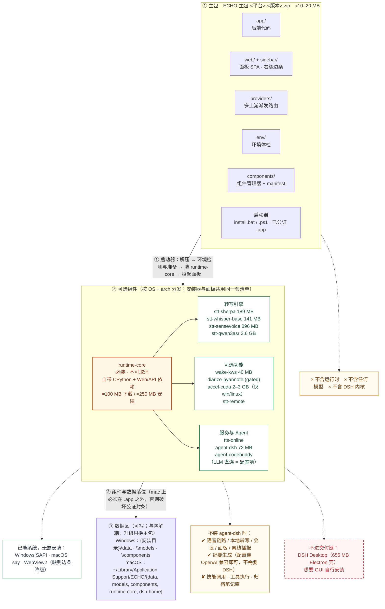
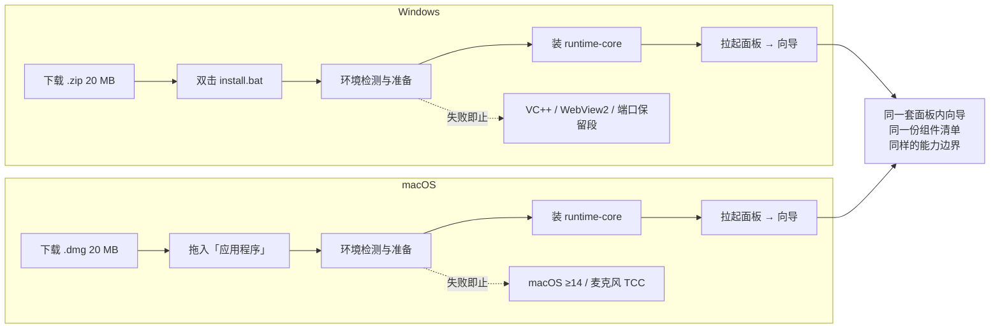

# ECHO 重构方案（核心 + 组件，Windows / macOS 双平台）

> 状态：**方案已定，待实施**。本文是 2026-09-18 讨论的结论固化，
> 决策项见 §3，实施分期见 §10，开工前必须先做完 §9 的 spike。
> 本文只描述"要变成什么样、怎么变"，不修改任何现有行为。

---

## 1. 要解决的三个问题

| # | 问题 | 目标 |
|---|---|---|
| 1 | 部署复杂 | **主包极小（仅核心代码）**、升级只换主包、不再依赖目标机器预装 Python；运行时与模型按需组件化 |
| 2 | 模型多、设备要求高 | **模型与推理引擎全部外挂**（D22）；组件分必装/可选；在线服务可配置 |
| 3 | 紧耦合 DSH | 换成官方 SDK 接入面；DSH 从"必备"降为可选组件 |

两条贯穿性要求：

- **主程序自己也要考虑系统环境**（§7）——环境不是安装脚本里检查一次，
  而是主程序运行时的一等公民；
- **Windows 与 macOS 都是一等公民**（§5）——不做"主平台 + 附加能力"。

---

## 2. 现状基线（实测证据）

| 项 | 实测值 | 出处 |
|---|---|---|
| venv | 7.09 GB（CUDA torch 为主） | 本机 `venv` |
| `models/` | 13.2 GB（pyannote 5.2G / faster-whisper 5.0G / hub 1.8G / sensevoice 896M / sherpa 189M / kws 40M） | 实测 |
| DSH Desktop | 655 MB（Electron，`dsh-plugin-desktop` 2.0.11） | `resources/app/package.json` |
| 交付包 | ≈8.8 GB / 6 万文件，解压 5–20 分钟 | 内网整包说明（原 `docs/新机器部署指南.md`，2026-09-18 已移出公开仓库） |
| 模型入库 | `git ls-files models` = **0 条**（`models/` 已 gitignore） | git |

**必须先纠正的现状问题：**

1. **文档与现实不符**：原《新机器部署指南》称 KWS 唤醒词与 pyannote "已在 git 里"，
   实际都不在库里。全新 clone 拿不到这两个模型，而它们是"必装"项。
2. **基础包其实可以完全没有 torch**：`sherpa-onnx`（ONNX Runtime，189 MB 模型，
   `app/audio/stt.py` 已实现，唤醒词也用它）与 `faster-whisper`（ctranslate2，无需 torch）
   都是现成的低资源路径；默认引擎 SenseVoice 反而是最重的组合（funasr + torch + 896 MB）。
3. **DSH 耦合是私有面而非集成**：
   - `app/agents/dsh_agent.py` 逆向 Desktop 的 HTTP JSON-RPC，并按 HMAC 自铸
     `dsh-auth-*` 签名 Cookie（密钥取自 `~/.dsh/.credentials.yaml`）；
   - `app/llm_router.py` 改写 `~/.dsh/settings.yaml` 与 `.credentials.yaml`，
     每次 sync 落一份 `.bak-echo-auto-<时间戳>`（本机已积压约 90 个）；
   - `assistant.py` / `meeting.py` / `worklog.py` / `api.py` / `manager.py`
     全部 `from app.dsh import get_client`，而 `get_client()` 恒返回 DSH 适配器 ——
     已有的 `AgentAdapter` 抽象 + `agentBackend` 配置 + `codebuddy.py` 目前只有面板在用。
4. **macOS 在契约层面就是二等公民**：
   - `tests/test_platform_contract.py` 断言 `app/` 里**不得出现 `darwin` 分支**、
     共享 `DEFAULTS` **必须是 Windows 值**、mac 只能靠 `sys.modules` 注入；
   - `mac/run_mac.py` 靠 monkeypatch 覆盖 `DEFAULTS` 与 `_mac_seed_defaults`
     来实现 mac 默认值（`sttModel=base`、`device=cpu` 等）——每加一个配置键都要
     在入口里补一次判断，且静默漂移；
   - CI 的 `static` job 只跑 `ubuntu` + `windows`，**mac 从未被验证**。

---

## 3. 已定决策

| # | 决策项 | 结论 |
|---|---|---|
| D1 | **推荐组合预设** | 默认推荐安装 **sherpa-onnx + whisper-base**（免 torch）；**但主包不含任何模型或引擎**（见 D22） |
| D2 | 组件交付形态 | **在线下载为主**（ModelScope / hf-mirror / PyPI），**离线组件包兜底** |
| D3 | 远程 STT | **纳入设计**：STT 可拆为独立小服务，重模型放有 GPU 的机器 |
| D4 | agent 后端 | **标准 DSH**（官方 Python SDK + `--profile sdk`），**Desktop 不进交付链** |
| D5 | agent 能力诉求 | 未来要靠 agent 后端驱动 **skill** 完成更多任务（不止纪要）→ 必须用完整 `sdk` profile，**不能用 `sdk-minimal`** |
| D6 | dsh home | **独立 `{DATA}/dsh-home`** + 挂载共享技能目录 |
| D7 | 预发布风险 | **接受**官方 SDK（当前 `0.1.5rc1`），但**锁版本 + 保留回退后端** |
| D8 | 解释器策略 | **自带可重定位 CPython**，不依赖系统 Python（消灭 `pyvenv.cfg` 迁移坑） |
| D9 | 右缘边条 | **随主包**（二进制小且与签名绑定），环境缺失（无 WebView2 / 未构建 .app）时**自动降级**为浏览器面板 |
| **D10** | **双平台定位** | **Windows 与 macOS 均为一等公民**：引入 `app/platform/` 显式接缝，**废弃 `sys.modules` 注入** |
| **D11** | **配置默认值** | 改**声明式 per-platform 默认值**（`PLATFORM_DEFAULTS`），不再运行时 monkeypatch `DEFAULTS` |
| **D12** | **契约与 CI** | 重写 `test_platform_contract.py` 为"平台差异只允许出现在 `app/platform/<os>/`"；CI `static` 加 **macOS** |
| **D13** | **mac 分发** | **`.app` 包**交付（承载 TCC 权限与签名身份），配套 `Info.plist` 权限声明 |
| **D14** | **mac 签名** | **Developer ID 签名 + 公证（notarization）**，交付物为已公证的 `.app` / `.dmg` |
| **D15** | **mac 系统地板** | **macOS 14.0+**（对齐 `agent-dsh` 平台要求），不再做版本条件过滤 |
| **D16** | **mac 全局热键** | **交给 Swift 原生宿主**（不再用 `pynput`）：TCC 挂在签名 `.app` 上，热键不依赖终端授权 |
| **D17** | **接缝推进** | `app/platform/` **P3 一次性分层做完**，不拆期 |
| **D18** | **`ECHO_DATA` 布局** | **分平台，且只承载系统数据**：Windows `{安装目录}/data`；macOS `~/Library/Application Support/ECHO/` |
| **D19** | **mac 常驻宿主** | **边条 `.app` 增加无窗口常驻模式**（一份签名、一个 LaunchAgent，不另建 Helper.app） |
| **D20** | **用户内容路径** | **会议目录、笔记库、模型目录都成为用户可指定的配置项**；大块头数据不再受 `ECHO_DATA` 约束，迁移只涉及小体积系统数据 |
| **D21** | **路径安全与校验** | 目录穿越校验按**请求时的配置**解析（不再用 import 期常量）；配置保存前做绝对路径 / 可写性 / 危险位置 / ASCII 校验 |
| **D22** | **主包极简** | **所有模型与推理引擎全部外挂为组件；主包只含核心代码 + 启动器 + 组件清单**（约 10–20 MB） |
| **D23** | **组件分级与首装策略** | 组件分 **必装**（`runtime-core`）与 **可选**；**首装只装 `runtime-core`**，随后由**环境感知的分步引导向导**逐项让用户决定装哪些模型 |
| **D24** | **引导向导** | 向导 = **先环境检测与准备，再分步引导**；**向导 UI 写在面板里**（一套 Web UI 两平台共用），安装器只负责"检测/准备 → 装 `runtime-core` → 拉起 ECHO → 自动打开面板进入向导"。不满足条件的选项**显示但禁用并说明原因**，不隐藏 |
| **D25** | **模型路由归属** | **多上游派发路由属于主包**（`dsh-failover/` 是 ECHO 自己的代码，约 70 KB），重构为 **LLM provider 的一种实现**（`openai-compat + failover`）；"注册进 DSH 配置"那一半改为**仅在装了 `agent-dsh` 时可选执行** |
| **D26** | **会话可见性** | **ECHO 自带一个 web 实例**：用 ECHO 的 `dsh-home` 起 `dsh --profile web`（独立端口，由统一端口分配器分配）；**同时**在面板内嵌会话视图。两条路径并存，**彻底不依赖 Desktop**（§8.3） |

### 3.1 D4 的依据

DSH Desktop 与标准 DSH **不是两个产品，是同一内核的两种壳**：
Desktop 是 `dsh-plugin-desktop`——"an Electron shell composed as a DeepSeek Harness
Cordis plugin"，内置同一份 `@deepseek-ai/dsh@0.1.5-rc.2`；`@deepseek-ai/dsh` 的 README
明确 `desktop` 这个名字**保留给 Electron 持有的 profile**，CLI 拒绝管理它。两者共用 `~/.dsh`。

选标准 DSH 的理由：

| 维度 | 标准 DSH（SDK） | DSH Desktop（现状） |
|---|---|---|
| 接入面 | 官方 stdio JSON-RPC，协议标识 `deepseek-harness-sdk-runtime`，有具名请求/结果/通知类型 | 逆向 HTTP JSON-RPC + 自铸签名 Cookie |
| 前置条件 | 无（SDK 自带运行时，**不需要系统 Node**） | 需登录 + 手动开 `dsh-desktop.mode=compatibility` |
| 配置读写 | 独立 `dsh_home`，**SDK 故意不发现 `~/.dsh`** | 改写 `~/.dsh/settings.yaml` / `.credentials.yaml` |
| 生命周期 | ECHO 可拉起/守护/锁版本 | GUI 手动开；Electron 自动更新会重建 `app.asar.unpacked` |
| 体量 | win_amd64 运行时 wheel **72 MB** | 655 MB |
| 平台 | Linux x64/arm64、macOS arm64/x64、Windows x64 | Windows 为主的 Electron 壳 |
| 技能面 | `dsh-skill` / `dsh-skill-filesystem` / `dsh-mcp-client` / `dsh-workflow` / `dsh-subagent` 全在 | 相同 |

**Desktop 的唯一保留用途**：你本人想要 GUI 手动对话 / 管插件 / 审批，自行安装即可，
与标准 DSH 共用 `~/.dsh`，技能与会话互通。

**发布形态**（PyPI）：

- [`deepseek-harness-sdk`](https://pypi.org/project/deepseek-harness-sdk/)（0.1.5rc1，MIT，Python ≥3.10）
- [`deepseek-harness-runtime-bin`](https://pypi.org/project/deepseek-harness-runtime-bin/)（同版本，
  把 `dsh` CLI 与闭源 Node 依赖树打成原生可执行文件；仅发布 wheel）
- 目标平台：`win_amd64`、`manylinux_2_28_x86_64`、`manylinux_2_28_aarch64`、
  `macosx_14_0_arm64`、`macosx_14_0_x86_64`。**没有 Windows arm64**；
  **macOS 侧要求 14.0+**（这是 `agent-dsh` 组件的平台地板，见 §6.3）。

---

## 4. 目标架构

```
ECHO 主包（10–20 MB：只有代码，没有运行时/引擎/模型 —— D22）
├── app/            单进程 FastAPI（组件化）
├── app/platform/   平台接缝层（win32 / darwin，未来 linux）
├── providers/      LLM/ASR/TTS provider；含**多上游派发路由**（原 dsh-failover，D25）
├── web/ + sidebar/ 面板 SPA + 右缘边条（环境缺失时自动降级）
├── env/            环境体检（EnvironmentReport，双平台探针）
├── components/     组件管理器（清单 / 安装 / 卸载 / 校验 / 依赖 / 平台过滤）
└── 启动器          Windows install.bat/ps1 · macOS 已公证 .app

Components（按 OS + arch 分发；缺 runtime-core 则跑不起来 —— D23）
├── runtime-core              必装：可重定位 CPython + Web/API 基础依赖
├── stt:{sherpa, whisper-tiny|small|medium|large-v3, sensevoice, qwen3asr}
├── wake:kws                  唤醒词模型
├── diarize:pyannote          （gated 模型，不随包分发，仅引导获取）
├── accel:cuda                （仅 Windows / Linux；macOS 无 CUDA）
├── tts:online                （edge-tts 等）
├── agent:dsh                 （deepseek-harness-sdk）
├── agent:codebuddy           （CLI 探测）
└── stt-remote                （STT 独立小服务 / 指向远程 GPU 机器）

Providers（在线服务，与本地引擎并列、可配置、带出网标注）
├── asr:  local-* | openai-compat | 云厂商 | 内网
├── llm:  agent-dsh | agent-codebuddy | openai-compat(直连)
└── tts:  edge-tts | sapi(win) | say(mac) | azure | 内网

Agent 后端能力矩阵
├── CHAT       纪要 / 摘要 / 改写 / 议题分段   → 内置直连 OpenAI 兼容即可
└── TOOLS+SKILL 执行指令 / 调技能 / 写笔记库    → 需要 agent 产品（标准 DSH / CodeBuddy / …）
```

**能力路由原则**：ECHO 声明所需能力 → 选支持该能力的后端 → 缺能力时面板明确提示并优雅降级，
不做静默失败。

### 4.1 图：主包与可选组件的关系

可直接打开：[packaging.svg](packaging.svg)（自包含 SVG，双击用浏览器看）。

同一张图的 mermaid 源码（可编辑；GitHub / Obsidian / ECHO 面板都能渲染）：



**读图要点**：

1. 主包里**只有代码** —— 没有 Python 运行时，也没有任何一个模型；
2. `runtime-core` 是**唯一必装**组件，其余组件全部依赖它，彼此之间互不依赖；
3. 组件与数据都落在**数据区**（mac 上必须在 `.app` 之外），所以升级只换主包；
4. `agent-dsh` 只是"服务与 Agent"里的一项，**不装也照样能出纪要**（走直连 LLM）。

### 4.2 图：Windows 与 macOS 的差异

可直接打开：[packaging-platforms.svg](packaging-platforms.svg)。

**结论：分层结构完全一致，差在外壳、落位、权限、签名四处。**

| 维度 | Windows | macOS | 依据 |
|---|---|---|---|
| **A 主包形态** | `.zip` + `install.bat/ps1`，解压到 `D:\ECHO`，可便携 | 已签名+已公证的 `.dmg` 内含 `.app`，拖入「应用程序」 | D13/D14 |
| **B 组件落位** | 位置自由：`{安装目录}\components\` 或直接进 `runtime\Lib\site-packages` | **必须在 `.app` 之外**：`~/Library/Application Support/ECHO/components/`，runtime 用 overlay 加载 | §5.7 |
| **C 数据区** | 程序目录内（`{安装目录}\data·\models`），整目录拷走即迁移 | 用户目录（`~/Library/Application Support/ECHO/`），`/Applications` 只读 | D18 |
| **D 边条与宿主** | .NET 7 + WebView2，随主包；缺 WebView2 → 降级浏览器；**没有常驻宿主概念** | Swift AppKit+WKWebView 的 `.app`，独立签名+公证；**同一 .app 兼任常驻宿主**，持有热键与 TCC | D9/D16/D19 |
| 热键 | 主进程 `ctypes` 注册，无需额外授权 | Carbon `RegisterEventHotKey`，**不需要辅助功能授权** | D16 |
| 平台专属组件 | `accel-cuda` **仅此平台** | **无 CUDA**（`device=cpu`） | §6.3 |
| 平台前提 | Windows 10/11 x64；VC++ 2015-2022 运行库 | **macOS 14.0+**；首次需麦克风 TCC | D15 |
| 缺失风险 | win-arm64 无 `agent-dsh` wheel | 外挂运行时的 TCC 归属待验证（S12） | §8.3 / S12 |
| **完全相同的部分** | 同一份 `app/` 与 `web/` · 同一份组件清单 `manifest` · 同一套面板内引导向导 · 同样的组件与体积 · **同样的能力边界**（不装 `agent-dsh` 时纪要靠直连 LLM 仍可用，只有技能/工具/归档不可用）· 都不需要系统 Python 或 Node | — |

两条流程的差异只在头尾：



**一句话**：从向导往后的每一步，两个平台是同一份代码、同一份清单、同一套判断；
平台差异全部收在**包的外壳、组件的落位、数据的归属、边条宿主的实现**这四处
（也就是 §5 的 `app/platform/{win32,darwin}/` 接缝层）。

---

## 5. 跨平台架构（D10–D17）

### 5.1 现状的问题

| 现状 | 问题 |
|---|---|
| `mac/run_mac.py` 用 `sys.modules` 注入 `app.hotkey` / `app.runtime` | 隐蔽：`app/` 完全不知道自己在 mac 上；错误信息、组件详情串、恢复路径全是 Windows 口径 |
| monkeypatch `DEFAULTS` + `_mac_seed_defaults` | 每加一个配置键都要在入口补判断；mac 默认值不可 grep、不可测试、静默漂移 |
| `test_platform_contract.py` 禁止 `app/` 出现 `darwin` | 把"mac 二等公民"写成了断言 —— 主程序**被禁止**做平台感知 |
| CI `static` 只跑 ubuntu + windows | mac 路径从未被验证过 |
| `mac/` 与 `app/` 平级、实现混在入口脚本里 | 平台实现没有归属，mac 与 win 的对应关系靠人记 |

### 5.2 目标：显式平台接缝层

```
app/platform/
├── __init__.py          # 选定后端（win32 / darwin），对外只暴露接缝对象
├── base.py              # 协议定义（Protocol/ABC）+ 契约测试的基准
├── win32/
│   ├── hotkey.py        # ctypes RegisterHotKey + WH_KEYBOARD_LL + 媒体键
│   ├── panel.py         # 右缘边条（.NET + WebView2）+ 应用窗口/浏览器
│   ├── tts.py           # SAPI
│   ├── notify.py        # 系统通知
│   ├── autostart.py     # 启动文件夹 + vbs 隐藏启动器
│   ├── audio.py         # 设备枚举 / WASAPI 特性
│   ├── compute.py       # CUDA 探测（驱动版本 → cu128/cu121）
│   └── env.py           # VC++ 运行库 / WebView2 / .NET / 长路径 / 端口保留段
└── darwin/
    ├── hotkey.py        # 见 §5.5（pynput 或原生宿主）
    ├── panel.py         # AppKit + WKWebView 浮动框，未构建退浏览器
    ├── tts.py           # `say`（离线兜底）
    ├── notify.py        # 通知中心（osascript）
    ├── autostart.py     # LaunchAgent plist
    ├── audio.py         # CoreAudio 设备枚举 / 采样率
    ├── compute.py       # 无 CUDA；arm64/x64 判定
    └── env.py           # macOS 版本 / TCC 授权 / Gatekeeper / 签名状态 / PortAudio
```

**接缝清单**（业务代码只依赖这些，内部不得出现 `os.name` / `sys.platform` 分支）：

`hotkey` · `panel` · `tts` · `notify` · `autostart` · `audio` · `compute` · `env` · `paths`

`mac/` 目录保留为**打包与宿主目录**（Swift 边条源码、`Info.plist`、构建脚本、
`.app` 组装、启动脚本），Python 实现迁入 `app/platform/darwin/`。

### 5.3 配置默认值改为声明式（D11）

```python
DEFAULTS = { ... }                    # 平台无关的公共默认值
PLATFORM_DEFAULTS = {
    "win32":  {"sttModel": "sensevoice", "device": "auto",   "panelOpenMode": "sidebar"},
    "darwin": {"sttModel": "base",       "device": "cpu",    "panelOpenMode": "sidebar"},
}
```

收益：

- mac 默认值可 grep、可单元测试、可审计，不再靠 monkeypatch；
- `panelOpenMode` 的候选值也按平台给（win: `sidebar|app|browser`，mac: `sidebar|browser`）；
- "库里继承来的 `sttModel=sensevoice` 但本机没装 funasr"这类问题，
  交给**组件可用性检查**处理（§6 已能回答"这个引擎装没装"），
  而不是在 seed 阶段静默改配置。

### 5.4 契约与 CI 重写（D12）

新的三条硬约定（替换现有四条）：

1. **平台差异只允许出现在 `app/platform/<os>/` 内**。`app/` 其它目录（含 `scripts/`）
   不得出现 `sys.platform` / `os.name` / `darwin` / `win32` 分支（白名单除外）。
2. **两套实现必须满足同一协议**：用契约测试遍历 `base.py` 声明的每个接缝，
   断言 `win32/` 与 `darwin/` 都有实现且方法签名齐全 —— 缺一个就红，
   而不是靠运行时才发现。
3. **`PLATFORM_DEFAULTS` 必须覆盖两个平台的全部平台相关键**；
   平台相关键新增时，两边都要给值（缺值即测试失败）。

CI 调整：

| job | 现状 | 目标 |
|---|---|---|
| `static` | ubuntu + windows | **ubuntu + windows + macos**（契约测试三平台都跑） |
| `platform-smoke` | 无 | 新增：windows 与 macos 各跑一次"导入 `app.main` + 起服务 + `/api/status`" |
| `windows-smoke`（重依赖） | 手动/每周 | 保留 |

### 5.5 macOS 侧的一等公民要求（D13–D16）

| # | 要求 | 说明 |
|---|---|---|
| M1 | **`.app` 包交付** | TCC（麦克风/辅助功能/输入监控/通知）授权是**按签名应用身份**授予的。当前 `mac/sidebar/Info.plist` 没有 `NSMicrophoneUsageDescription`（录音在 Python 进程里），若继续裸跑 Python，权限只能挂在"终端"上，用户换终端就失效 |
| M2 | **`Info.plist` 权限声明** | 补 `NSMicrophoneUsageDescription`、`NSAppleEventsUsageDescription`（osascript 通知/自动化）；`LSMinimumSystemVersion` 提到 **14.0**（D15）；保留 `LSUIElement`、`NSAllowsLocalNetworking` |
| M3 | **Developer ID 签名 + 公证**（D14） | `build_sidebar.sh` 现在的 ad-hoc 签名（`codesign --force --sign -`）不够：需要 **Developer ID Application** 证书、`--options runtime`（强化运行时）、`--timestamp`、再用 `xcrun notarytool submit --wait` + `xcrun stapler staple`。**所有嵌套 Mach-O 都要逐个签名**（见 §5.7） |
| M4 | **TCC 引导** | 面板"环境体检"页给出每项权限的状态、用途说明与 `x-apple.systempreferences:` 深链，并解释"为什么需要" |
| M5 | **PortAudio 内置** | 现状 `setup_mac.sh` 用 Homebrew 装 `portaudio`。自带运行时后把 dylib 打进 **`runtime-core` 组件**（D22），去掉 Homebrew 依赖 |
| M6 | **热键交给原生宿主**（D16） | 由签名的 Swift 宿主注册全局热键，Python 侧只做薄客户端。**用 Carbon `RegisterEventHotKey` 而非 `NSEvent.addGlobalMonitorForEvents`**：前者**不需要辅助功能授权**，后者必须授权 —— 这是 mac 体验的关键差别。宿主已带端口参数，热键触发直接 POST ECHO 本地 API（回环，`netguard` 放行） |
| M7 | **常驻宿主**（D19） | 热键依赖宿主常驻，因此**边条 `.app` 增加无窗口常驻模式**（LaunchAgent 拉起，`LSUIElement`，不显窗口）：常驻实例持有全局热键与 TCC 授权，面板窗口按需创建/收起。一份签名、一个 LaunchAgent，不另建 Helper.app。否则用户收起面板就失去热键 |
| M8 | **平台地板统一** | D15 定在 macOS 14.0+ 后，`agent-dsh` 与边条的地板一致，不再需要版本条件过滤；env 报告只做"够不够 14.0"的单一判定 |
| M9 | **离线 TTS** | Windows 是 SAPI，macOS 是 `say`；两者都属"离线"档，`ttsEngine` 候选值与文案按平台给 |
| M10 | **无 CUDA** | mac 上 `accel-cuda` 组件不出现；`device` 默认 `cpu`；`compute.py` 报告 arm64/x64 与可用加速（不做 MPS 承诺，除非实测） |
| M11 | **媒体键（新增能力）** | 有了常驻原生宿主后，mac 上耳机媒体键触发才具备可行性（现状明确不支持）。列为 P3 之后的增强项，不阻塞主线 |

### 5.6 两平台的对应关系一览

| 能力 | Windows（win32） | macOS（darwin） | 状态 |
|---|---|---|---|
| 全局热键 | `ctypes RegisterHotKey` + 低级钩子 + 媒体键 | **Swift 原生宿主**（Carbon `RegisterEventHotKey`，免辅助功能授权）+ Python 薄客户端 | win 已有 / **mac 待做（D16）** |
| 右缘边条 | .NET 7 WinForms + WebView2 | AppKit + WKWebView，已公证 `.app` | 已有 / 待签名 |
| 边条降级 | 无 WebView2 → 浏览器 | 未构建 .app → 浏览器 | 已有 |
| 常驻 helper | 无需（主进程注册热键） | **需要**：边条 `.app` 无窗口常驻模式（LaunchAgent，持有热键与 TCC） | **待做（D19）** |
| 离线 TTS | SAPI | `say` | 已有 |
| 在线 TTS | edge-tts | edge-tts | 已有 |
| 通知 | 系统通知 | 通知中心（osascript） | 已有 |
| 开机自启 | 启动文件夹 + vbs | LaunchAgent plist | win 已有 / mac 待做 |
| 转写 | sherpa / whisper / sensevoice / qwen3asr | 同（无 CUDA） | 已有 |
| 说话人分离 | pyannote | pyannote | 已有 |
| 加速 | CUDA（cu128/cu121） | CPU（不承诺 MPS） | 已有 |
| agent 后端 | 标准 DSH SDK（win_amd64） | 标准 DSH SDK（macos 14+，与地板一致） | **待做** |

### 5.7 公证约束与数据布局（D14 的连锁后果）

**公证会强制两件事；而 D22"运行时也外挂"恰好把公证面缩到最小：**

1. **所有嵌套 Mach-O 必须签名。** 采用 D22 后，bundle 内只剩 ECHO 自己的代码、
   `web/`、边条/常驻宿主的 Swift 二进制与 `.app` 启动器；**CPython、onnxruntime、
   ctranslate2、PortAudio、torch 系 dylib 全在 bundle 外**（属于组件），因此
   `notarytool` 的签名面大幅缩小 —— 这是 D22 意料之外的一个大收益。
   若 S12 判定解释器必须放回 bundle，则只有 CPython 需要纳入签名面。
2. **强化运行时会拒绝加载"非同一签名团队"的动态库。** 组件里的 native wheel
   （onnxruntime、ctranslate2、torch、DSH 运行时的 node-pty 等）来自不同签名者，
   因此 `.app` 的 entitlements 必须包含
   `com.apple.security.cs.disable-library-validation`（CPython/torch 通常还需要
   `com.apple.security.cs.allow-unsigned-executable-memory`）。
3. **组件不能装进已公证的 bundle。** 往 `.app` 里写文件会破坏签名封条
   （`codesign --verify` 失败，后续启动可能被系统拒绝）。因此：

```
/Applications/ECHO.app           ← 已公证、封条完好、永不写入（很小）
└── Contents/Resources/
    ├── app/  web/               ← 主包（D22）
    └── sidebar/ECHO Sidebar.app ← 边条 + 常驻宿主（独立签名 + 公证）

~/Library/Application Support/ECHO/   ← 一切可变内容（不在 bundle 内）
├── data/            echo.db、录音、日志
├── runtime-core/    可重定位 CPython + 基础依赖（组件，约占大头的是它）
├── models/          模型权重
├── components/      其它组件（site-packages overlay）
├── dsh-home/        DSH 独立 home
└── runtime-overlay/ 组件新增的 DLL/dylib 搜索路径
```

实现方式：启动器把 `runtime-core/` 与 `components/` 及 `runtime-overlay/` 挂在
`sys.path` / `DYLD_FALLBACK_LIBRARY_PATH` 上（mac 用 overlay；
Windows 可直接装进 `runtime/Lib/site-packages`，无需 overlay）。

**`ECHO_DATA` 的归属（D18，已定）**：分平台解析，`app/platform/<os>/paths.py` 是唯一出处。

| 平台 | 程序位置（只读/封条完好） | 数据位置（可写） |
|---|---|---|
| Windows | 安装目录（如 `D:\ECHO`） | `{安装目录}/data`、`{安装目录}/models`（保持便携：整目录拷走即迁移） |
| macOS | `/Applications/ECHO.app` | `~/Library/Application Support/ECHO/{data,models,components,dsh-home}` |

注意两个后果：

1. 配置里的 `{ECHO}` / `{DATA}` 占位符语义要跟着变：`{ECHO}` 在 mac 上指
   **程序目录**，`{DATA}` 指 **Application Support 下的数据目录**，两者不再有父子关系
   （`app/config.py:expand_path` 需按平台解析）。

### 5.8 存储路径策略（D20、D21）

D18 的迁移麻烦（"mac 换布局要搬 data/"）之所以成立，是因为我们把**所有** `data/` 下的
东西当成一个整体。按用途拆开后，只有很小一部分受平台布局影响 —— **大块头交给用户指定，
系统数据才由平台解析**。

#### 三类路径

| 类别 | 内容 | 策略 | 量级 |
|---|---|---|---|
| **A. 用户内容** | 会议数据（`01.wav` / `transcript.md` / `summary.md` / `meta.json`）、笔记库、模型权重 | **用户可指定**（D20） | GB～百 GB |
| **B. 系统数据** | `echo.db`、`logs/`、`captures/`、`echo-port.txt`、`*.pid`、`dsh-home/` | **平台解析**（D18），用户不必管 | MB 级 |
| **C. 组件** | `components/`、`runtime-overlay/` | 跟随 B，但 mac 上**必须在 bundle 外**（§5.7） | GB 级 |

新增/调整的配置项：

| 键 | 默认值 | 说明 |
|---|---|---|
| `meetingsDir` | `{DATA}/meetings` | **新增**。会议原始录音与转写/纪要文件的落地目录。现状是硬编码的 `meeting.MEETINGS_DIR`（`app/meeting.py:31`），且 import 时就 `makedirs` |
| `modelsDir` | `{ECHO}/models` | **新增**。现状硬编码在 4 处（`stt.py:21`、`modelinfo.py:30`、`wake.py:18`、`diarize.py:26`） |
| `worklogVaultRoot` | 空 | **已有**（笔记库根目录），保留并补校验 |
| `{MEETINGS}` | — | 新增占位符，供其它配置引用会议目录 |

#### 收益：迁移成本从"搬几十 GB"降到"搬一个 SQLite 文件"

旧版 mac 用户升级时：`echo.db` + 日志是 MB 级，脚本搬移即可；而会议录音、模型、笔记库
本来就该由用户决定位置 —— 提示把 `meetingsDir` / `modelsDir` 指回原目录，**文件一个都不用动**。

#### 必须处理的四个坑

**1. 改路径会让旧会议"消失"。** DB 里存的是相对文件夹名（`2026-08-21_10-00-00`），
文件靠 `MEETINGS_DIR + name` 找。改配置后记录还在、文件找不到。两种做法：

- **(a) 记录级绝对路径**：每条会议记录自己的目录 → 改路径不影响旧会议，甚至能指向多个位置；
  代价是每条记录要迁移、安全校验要按记录路径做。
- **(b) 单一根 + 相对名（推荐）**：保留 `api.py:_safe_under` 那道目录穿越防护的简单性
  （`DEPLOY.md` §7 第 3 层安全边界）；改路径时提示"**不会移动旧文件**"，并提供
  「迁移已有会议」动作（新目录非空则先警告）。

**2. 安全校验必须改成请求时解析（D21）。** `app/api.py:673,797` 用
`_safe_under(meeting.MEETINGS_DIR, ...)` 做穿越校验，而 `MEETINGS_DIR` 是 **import 期算好的
模块级常量**。一旦它变成用户可配置，**如果校验仍用旧常量，改配置后可能读到新根之外的文件**
—— 这是安全回归，必须改成每次请求按当前配置解析。同理 `meeting.py` 里 18 处 +
`api.py` 里 7 处引用都要换成 `meeting.meetings_dir()` 解析函数。

**3. 去掉 import 期副作用。** `app/meeting.py:31,34` 在导入时就 `os.makedirs(MEETINGS_DIR)`。
改为惰性解析 + 显式创建，否则：改配置要重启才生效，且只读场景下导入即失败。

**4. `meetingWorkspace` 与 `meetingsDir` 会冲突。** `meetingWorkspace`（DSH 工作区，用于
侧栏分组）默认值恰好也是 `{ECHO}/data/meetings`，纯属巧合重叠。用户把 `meetingsDir` 改到
`D:\会议` 后，`meetingWorkspace` 仍指旧目录 → DSH 侧栏分组错位。方案：`meetingWorkspace`
留空 = **跟随 `meetingsDir`**（内部用 `{MEETINGS}` 展开），并在设置页显示解析结果。

#### 配置校验规则（保存前执行）

| 规则 | 理由 |
|---|---|
| 必须是绝对路径（支持 `~` 与环境变量展开） | 相对路径会随启动目录漂移 |
| 可写性实测（建临时文件再删） | mac `/Applications`、Windows `Program Files` 普通用户不可写 |
| 不得与程序目录 / `components/` / 已公证 bundle 重叠 | mac 上写 bundle 会破坏签名封条（§5.7） |
| **`modelsDir` 强制 ASCII 校验**；`meetingsDir` 仅警告 | funasr/nagisa 读不了非 ASCII **模型**路径（已有事故）；音频路径是否同样受限**待 S11 验证** |
| `meetingsDir` 允许网络盘 / NAS，但 `echo.db` 永不跟随 | SQLite WAL + 文件锁在网络盘上不可靠 —— 这也是"会议文件与 DB 分离"的另一个理由 |
| 改路径不自动移动旧文件，改为提供「迁移已有会议」 | 避免几十 GB 的静默搬运与半途失败 |

---

## 6. 组件规格

### 6.1 清单字段（`components/*.json`）

```
id            唯一标识（如 stt-qwen3asr）
name          展示名
kind          runtime | model | provider | agent | service
platforms     支持平台标签：win-x64 / macos-arm64 / macos-x64 / linux-x64 / linux-arm64
min_os        最低系统版本（如 agent-dsh 在 mac 上要求 14.0）
size_mb       体积
sha256        校验和（离线包与下载缓存都校验）
sources[]     多个下载源（ModelScope / hf-mirror / PyPI 镜像 / 内网镜像）
install       安装动作（pip / 模型文件落盘 / 解压 / 执行脚本）
requires[]    依赖的其它组件
provides[]    提供的引擎与能力（如 stt:qwen3asr、cap:gpu）
needs_gpu     none | optional | required，及显存下限
egress        数据出网标注：none | vendor | internal | user-config
license       许可证与再分发约束
```

`platforms` + `min_os` 由 `EnvironmentReport`（§7）驱动过滤：
**不支持的组件不出现在面板上**，或在不可用原因里直接写明（例如
"macOS 13 不满足 `agent-dsh` 的 14.0 要求"）。

### 6.2 主包内容（D22：仅核心代码）

**主包不含任何模型、任何推理引擎、任何第三方依赖。**

| 组成 | 说明 | 约体积 |
|---|---|---|
| `app/` `web/` `assets/` `scripts/` `docs/` | 后端代码 + 面板 SPA + 提示音 + 脚本 + 文档 | ~6 MB |
| `providers/`（原 `dsh-failover/` + `app/llm_router.py`） | **多上游派发路由**（OpenAI 兼容入口 + 探测 + 熔断）；纯 Python，约 70 KB 代码（D25） | <1 MB |
| `components/*.json` + `manifest.json` | 组件清单与校验和（安装器与面板的唯一数据源） | <1 MB |
| `install.bat` / `install.ps1` | Windows 安装向导（含环境预检） | 几十 KB |
| `bootstrap`（mac） | `.app` 内的启动器与配置 | <1 MB |
| **合计** | | **≈ 10–20 MB** |

主包**按平台各出一份**（`win-x64` / `macos-arm64` / `macos-x64`），
共同部分是同一份 `app/` 与 `web/`。

**收益**：主包小到可以走邮件、IM、内网共享盘任意传递；它的变更频率也远低于组件，
升级只需替换这 10–20 MB。

**代价（必须用设计补上）**：主包本身**跑不起来**（没有运行时），也**不能转写**
（没有引擎与模型）。因此 D23/D24 的组件分级与引导向导不是可选项，是必需品。

### 6.2.1 组件分级（D23）

| 级别 | 组件 | 缺了会怎样 |
|---|---|---|
| **必装（首装即装）** | `runtime-core`：可重定位 CPython + Web/API 基础依赖（fastapi/uvicorn/pydantic/httpx/numpy/sounddevice/soundfile/soxr，mac 含 PortAudio） | 服务起不来，面板打不开 |
| **引导选择**（向导逐项问，不默认勾选） | `stt-sherpa`（189 MB）、`stt-whisper-base`（141 MB）、`wake-kws`（40 MB） | 缺则不能转写 / 不能唤醒（面板与管理功能仍可用） |
| **可选引擎** | `stt-sensevoice`、`stt-whisper-{small,medium,large-v3}`、`stt-qwen3asr` | 只影响转写精度与速度 |
| **可选功能** | `diarize-pyannote`、`accel-cuda`、`tts-online`、`agent-dsh`、`agent-codebuddy`、`stt-remote` | 只影响对应功能 |
| **已随系统** | Windows SAPI、macOS `say`、WebView2（win 若无则边条降级） | — |

**关键取舍**：`runtime-core` 是唯一"装不上就没法用"的组件，因此它必须
①**首装即装、不可取消**（灰显 + 说明）；②随任何离线合集必带；③在面板里显示为"基础运行时"。
其余组件**一律不默认勾选**，由 §6.2.2 的向导逐项引导 —— 诉求是"别替我决定"，
代价是"必须有人告诉他每项是干什么的"，这就落在向导身上。

### 6.2.2 首装引导向导（D23、D24）

首装**只自动装 `runtime-core`**，其余全部由向导逐项让用户决定。向导分两大段，
**顺序不能颠倒**：先检测与准备，再引导选择。

**职责划分（D24）**：

| 环节 | 谁做 | 形态 |
|---|---|---|
| 环境检测与准备 | **安装器**（`install.ps1` / macOS `.app` 启动器） | 非交互、无 UI 依赖 |
| 装 `runtime-core` | **安装器** | 无网时从离线包取 |
| 拉起 ECHO 并打开面板 | **安装器** | 此时已有 `runtime-core`，服务能起 |
| **分步引导选择** | **面板（Web UI）** | 一套代码两平台共用；与「组件」页是同一套渲染逻辑 |
| 之后补装/卸载组件 | **面板** | 向导随时可重入 |

这样用户感知上"向导是安装过程的一部分"（装完自动打开），实现上却只有**一套 UI**。
安装器里不写任何选择界面 —— 否则 PowerShell、Swift、面板会变成三套要同步维护的逻辑。

#### 第一段：环境检测与准备（不交互，约 10–30 秒）

| 检查/准备 | 不通过时的处理 |
|---|---|
| OS 版本与架构（Windows 10/11 x64；macOS ≥14.0；win-arm64 无 agent 组件） | 硬性不满足 → 直接终止并说明 |
| 磁盘空间（**按用户将要选的 `modelsDir` 所在盘算**） | 空间不足 → 引导换盘或减少选择 |
| VC++ 2015-2022 x64 运行库（Win） | 给出下载入口，或提示"装完组件也跑不起来" |
| WebView2 / .NET（Win，边条用） | 降级提示：边条不可用，面板仍可在浏览器打开 |
| GPU 厂商 / 型号 / 显存 / 驱动版本 | 无 N 卡 → 后续 CUDA 组件禁用；显存 <4 GB → Qwen3-ASR 标"会回退 CPU，慢约 20 倍" |
| 音频输入设备 | 无设备 → 提示录音功能不可用 |
| 端口保留段（Win） | 自动改用备用端口 |
| 安装路径字符 / 可写性 | 非 ASCII → 建议改用 ASCII，或至少把 `modelsDir` 指到 ASCII 目录 |
| **网络连通性**（ModelScope / hf-mirror / PyPI 镜像 / 内网网关） | **不可达 → 立即切到"离线组件包"路线**，并提示去哪拿 |
| 准备工作：建数据目录 / `components/` / 初始化 DB / 写 `echo-port.txt` | 失败即终止（此时还没下任何大文件） |

产出：`EnvironmentReport` + **推荐档位**（供第二段做默认高亮）。

#### 第二段：分步引导选择（每步一个决策）

| 步 | 决策 | 环境适配的默认建议 | 说明必须给出 |
|---|---|---|---|
| 1 | **转写引擎**（核心） | 无 N 卡 → sherpa（CPU 实时 189 MB）；有 N 卡且显存足 → 可加 Qwen3-ASR；中庸 → whisper-base | 体积、CPU/显存需求、预期倍速、语言、许可证。**可多选**（命令用快的、会议用准的，配置本来就支持分开） |
| 2 | 唤醒词 KWS | 默认不装 | 40 MB；需常开麦克风；隐私提示 |
| 3 | 说话人分离 pyannote | 默认不装 | 需额外依赖 + HF gated 授权；CPU 慢；**不随包分发** |
| 3.5 |（有 N 卡才出现）**GPU 加速** | 驱动版本决定 cu128 / cu121 | 2–3 GB；"不下也能跑，只是慢 5–10 倍" |
| 4 | **在线服务**（LLM） | 默认不配 | 内网网关 / DeepSeek 官方 / 任意 OpenAI 兼容；**支持多个上游组成模型组**（按序派发 + 熔断，即原 ECHO AUTO，D25）；**配了才能生成纪要**；明确标注数据出网 |
| 5 | 智能体后端 `agent-dsh` | 默认不装 | 72 MB（PyPI wheel，含自带 Node 的 `dsh` 运行时）；装了才能调技能 / 工具 / 归档笔记库。**不装也不影响纪要**（走第 4 步的直连 provider） |
| 6 | 离线兜底 | 默认不装 | whisper-tiny（75 MB）作为最小可用兜底 |
| 末 | **汇总** | — | "已装 / 未装 / 因未装而不可用的功能 / 以后在哪补" |

每步都有三个出口：**选它 / 跳过它 / 按建议全选**（"我懒得挑"的按钮，否则同事会卡在每一步）。

#### 设计约束

1. **不满足条件的选项显示但禁用 + 写清原因**，不隐藏 —— 隐藏会让用户以为 ECHO 没有这个功能。
2. **向导与面板是同一套 UI**（D24）：分步引导、组件管理、就绪状态都渲染同一份
   `manifest.json` + `EnvironmentReport`，不维护第二套；安装器只做非交互的检测/准备/安装/拉起。
3. **可重入、可中断**：中途退出不留半装状态；面板「组件」页随时能回到同一套引导。
4. **每一步都标"不做会怎样"** —— 用户装少了（转写不可用）和装多了（白下几个 GB）都要避免。
5. 向导结束后写出 `installed-components.json`，面板据此显示状态，不靠目录扫描猜。

### 6.3 可选组件

| 组件 | 平台 | 体积 | 获取 |
|---|---|---|---|
| `stt-sensevoice` | 全平台 | 896 MB + funasr/torch | 在线 / 离线包 |
| `stt-whisper-small|medium|large-v3` | 全平台 | 464 MB / 1.5 GB / 2.9 GB | 在线 / 离线包 |
| `stt-qwen3asr` | 全平台（GPU 推荐） | ~3.6 GB（含 ForcedAligner） | 在线 / 离线包 |
| `diarize-pyannote` | 全平台 | 模型 ~31 MB + torch/speechbrain | **仅引导获取**（HF gated，需同意条款，不再分发） |
| `accel-cuda` | **仅 win-x64 / linux-x64** | 2–3 GB | 在线（按驱动版本选 cu128/cu121） |
| `agent-dsh` | win-x64 / macos-arm64 / macos-x64 / linux-*（mac 地板与 D15 一致，无需额外过滤） | wheel 72 MB（**安装后占用待 S1 实测**） | PyPI（`deepseek-harness-sdk` + `deepseek-harness-runtime-bin`） |
| `agent-codebuddy` | win-x64 等 | ~0（探测既有 CLI） | 探测 |
| `stt-remote` | 全平台 | ~0 | 指向内网 STT 服务 |

**分发纪律**：模型权重继续留在 git 之外，只进 release 产物；仓库只维护清单与校验和。

---

## 7. 环境子系统（回应"主程序也要考虑系统环境"，双平台）

### 7.1 原则

**先把环境依赖"自带"，而不是"要求"** —— 由 **`runtime-core` 组件**提供可重定位 CPython
（D22 之后它不再躺在主包里，但对用户的效果一样：不依赖系统 Python），加 `PYTHONNOUSERSITE=1`、
不继承外部 `PYTHONPATH`、启动时校验 `sys.prefix`。这样"系统环境"的影响面从
"能不能跑"缩小到"硬件能力够不够"。

### 7.2 `app/platform/<os>/env.py` → `EnvironmentReport`

| 分组 | Windows | macOS |
|---|---|---|
| 运行前置 | OS 版本、VC++ 2015-2022 x64 运行库、WebView2、.NET、长路径支持、执行策略 | **是否 ≥ macOS 14.0**（D15 地板，不满足直接不给装）、`say` 可用性、PortAudio 可用性、Gatekeeper 隔离属性（`com.apple.quarantine`）、bundle 签名/公证状态。（Xcode CLT 只是**构建机**需要，终端用户不需要 —— 边条以预构建 `.app` 交付） |
| 授权 | — | TCC：麦克风 / 辅助功能 / 输入监控 / 通知 / 自动化，逐项状态 + `x-apple.systempreferences:` 深链 |
| 算力 | CPU 核数、内存、GPU 厂商/型号/驱动/显存 → CUDA 变体 | CPU 核数、内存、架构（arm64/x64）、是否有 Rosetta |
| 音频 | 输入设备枚举、采样率、是否被独占、蓝牙 | CoreAudio 设备枚举、采样率、默认设备 |
| 网络 | 代理、ModelScope / hf-mirror / PyPI / 内网网关连通性、证书 | 同 |
| 端口 | 动态保留段检测（Hyper-V/WSL）+ 统一分配器 | 统一分配器（无保留段问题，但需避开系统占用） |
| 既存环境 | `~/.dsh`、Desktop、Node、已有 ECHO 实例 | 同 |
| 平台标签 | `win-x64` | `macos-arm64` / `macos-x64` |

### 7.3 三处消费

1. **安装前 preflight**：能不能装、该装哪些组件、缺什么怎么补；不通过不往下走。
2. **面板"环境体检"页**：每项 ✅/⚠️/❌ + 一键修复（开长路径 / 装 VC++ 运行库 /
   装 WebView2 / 建 ASCII junction / 换端口 / 去隔离属性 / 打开对应系统设置页）。
3. **组件管理器兼容过滤**：见 §6.1。

### 7.4 已知必须覆盖的环境坑（历史事故）

| 平台 | 坑 | 现象 | 对策 |
|---|---|---|---|
| Win | 非 ASCII 路径 | funasr/nagisa 读不了模型，报 `Could not read model …nagisa_v001.model` | 安装器强校验 + junction 一键修复 |
| Win | 动态端口保留段 | `bind` 失败（Errno 13），端口漂移 | 保留段检测 + 统一分配器 |
| Win | 组策略拦 `-WindowStyle Hidden` | 自启无窗口失败 | 沿用 vbs 启动器方案 |
| Win | ps1 无 BOM 含中文 | PowerShell 5.1 报"字符串缺少终止符" | 脚本纯 ASCII 或带 BOM（已有约定） |
| 双 | 拷贝 venv | `Fatal Python error: init_fs_encoding` | **自带运行时后此坑消失** |
| Win | Electron 升级 | `app.asar.unpacked` 被重建，插件消失 | **改用 SDK 后此坑消失** |
| Mac | 未声明麦克风用途 | 打包成 .app 后录音被 TCC 拒绝且不弹窗 | `Info.plist` 声明 + 体检页引导 |
| Mac | Gatekeeper 隔离 | 下载的包"无法验证开发者" | 签名 + 公证（D14，见 §12） |
| Mac | 裸跑 Python 的授权归属 | 权限挂在"终端"上，换终端即失效 | 改为 `.app` 承载（§5.5 M1） |
| Mac | Homebrew 依赖 | 现状需 `brew install python@3.11 portaudio` | 自带运行时 + 内置 PortAudio |

---

## 8. Agent 后端（标准 DSH）

### 8.1 分层：DSH 的什么在主包、什么在组件

**结论：DSH 的运行内核不在主包里。** 主包里只有 ECHO 自己写的接入代码。

| 层 | 内容 | 归属 | 体积 |
|---|---|---|---|
| ECHO 的**接入代码** | `app/agents/dsh_sdk_agent.py`（AgentAdapter 实现）、能力路由 `app/agents/__init__.py` | **主包**（是 Python 代码） | ~30 KB |
| DSH 的**运行内核** | 标准 `dsh` CLI + 自带 Node 运行时 + 插件闭包（`deepseek-harness-runtime-bin`） | **组件 `agent-dsh`** | wheel 72 MB（**压缩值**，见下） |
| DSH 的 **profile 与 home** | `{DATA}/dsh-home/profiles/sdk`（含 `cordis.patch.yml`）、`skills/`、`sessions/` | **运行时生成**（数据区，不在任何包里） | — |
| DSH **Desktop** | 655 MB Electron 壳 | **完全不进交付链**（用户想用 GUI 自己装） | — |

#### `agent-dsh` 到底是什么（避免与 Desktop 混淆）

`agent-dsh` 组件实际装**两个 wheel**：

| wheel | 体积 | 作用 |
|---|---|---|
| `deepseek-harness-sdk` | 13.7 KB | 薄客户端：Python 侧 API（`DeepSeekHarness` / `Session.run`），它只负责拉起并驱动下面的 CLI |
| `deepseek-harness-runtime-bin` | **72 MB**（`win_amd64`，**wheel 是压缩值**） | 把**标准 `dsh` CLI + 它闭包的 Node 运行时**打成一个原生可执行文件 |

按上游说明，这个运行时：

- 是 **`dsh` CLI 本体**，不是 Desktop（没有 Electron / Chromium，也没有 Desktop 的插件市场与更新器）；
- **不需要系统 Node**（Node 运行时在包内）；
- 带**同一套 shipped profiles**：`sdk`、`sdk-minimal`、`headless`、`acp`，以及**完整的 `web` profile（含前端资源）**；
- 只发布 wheel（无 sdist），平台覆盖 win-x64 / macos-arm64 / macos-x64 / linux-x64 / linux-arm64，**没有 Windows arm64**。

**两点要注意**：

1. **72 MB 是压缩后的 wheel**，装完解压会明显更大（原生 exe + Node 运行时 + 插件闭包 +
   ripgrep sidecar + web 前端资源，估计 3–4 倍）。**清单里的 `size_mb` 应记安装后占用**，
   具体数值由 S1 实测确定 —— 引导向导里给用户看的必须是安装后体积，否则磁盘预估会错。
2. **它不含任何"内容"**：模型、API 凭据、技能脚本、会话数据全都不在包里 —— provider 与
   key 由 ECHO 通过 `initialize`（或 profile patch）传入，技能是数据（挂载目录），
   会话落在 `dsh-home/sessions`。

**一个副产品**：既然 `web` profile 与前端资源都在这个 72 MB 里，**"想要 GUI"并不需要装
655 MB 的 Desktop** —— `dsh --profile web` 自己就能起浏览器版界面。这条对"Desktop 不进交付链"
是个有力的补充，建议在 S1 里顺手验证（跑起来能打开界面即算通过）。

**不装 `agent-dsh` 时的能力边界**（这也是为什么它可以只是可选组件）：

| 能力 | 不装 agent-dsh | 依据 |
|---|---|---|
| 语音链路、本地转写、会议录音+转写、面板、离线 TTS、边条 | ✅ 可用 | README：「ECHO 可以完全脱离 DSH 独立启动（转写、会议、面板都不依赖它）」 |
| **纪要生成**（CHAT 能力） | ✅ **仍然可用** —— 只要在第 4 步配了直连 OpenAI 兼容服务 | P5 provider 抽象 |
| 技能调用、工具执行、归档笔记库（TOOLS+SKILLS 能力） | ❌ 不可用，面板明确提示并给安装入口 | 能力路由按 capability 判定 |

**接入代码必须在主包里的原因**：`AgentAdapter` 的 `available()` 契约要求"未安装时返回
可读的原因 + 怎么修"。适配器得先存在于主包，才能告诉用户"没装 `agent-dsh` 组件"。

### 8.2 布局

```
{DATA}/dsh-home/
├── profiles/sdk/            # dsh --profile sdk --dump-default-config 初始化
│   ├── package.json
│   └── cordis.patch.yml     # ECHO 写这里：provider / 技能挂载
├── skills/                  # 挂载 ~/.dsh/skills（链接或同源目录）
└── sessions/                # 会话持久化
```

**不再**写 `~/.dsh/settings.yaml` / `.credentials.yaml`；provider 与凭据走 profile 级 patch
或每次调用的 `patches=(...)`（按 SDK 文档，patch 在 profile 层与 home 层之后依次叠加）。

Windows 与 macOS 结构一致，仅 `dsh` 可执行文件来自各自的平台 wheel。

### 8.3 会话可见性：D6 的代价（必须正视）

**问题**：重构后，用户在 `dsh web` / Desktop 里还能不能翻到 ECHO 产生的会话？

**本机实测证据**（`~/.dsh` 的目录结构回答了"会话存在哪一层"）：

| 观察 | 结论 |
|---|---|
| `~/.dsh/sessions/` 下是 **13 个按工作区路径编码的目录**：`--C-Users-zhkq-Desktop-~5B66~4E60-ECHO-public--`、`--…-ECHO-public-data-meetings--`、`--…-ECHO-_tmp_vault--` … | **会话是 home 级存储**，按 cwd/工作区分组 |
| `~/.dsh/profiles/{desktop,web}/` 下只有 `cordis.yml`、`cordis.patch.yml`、`package.json`、`pnpm-lock.yaml`、`node_modules` | **profile 只管插件树与配置**，不含会话 |
| `~/.dsh/sessions/` 里已经有 `ECHO-public-data-meetings` | **今天 ECHO 的会议会话就在 `~/.dsh` 里**（因为走 Desktop，而 Desktop 用 `~/.dsh`） |

**所以答案是**：

| 时点 | 能否在一个 web 界面看到 ECHO 的全部会话 |
|---|---|
| **今天** | ✅ 能。ECHO 走 Desktop 的 HTTP API，Desktop 用 `~/.dsh`；会话按工作区出现在同一个列表里 |
| **重构后（D6 独立 `dsh-home`）** | ❌ **默认看不到**。SDK 故意不发现 `~/.dsh`，会话又是 home 级 → 两个 home = 两套互不可见的会话 |

**这是一次真实的可见性回退**，必须给用户一个交代。三条路：

| 方案 | 做法 | 优 | 劣 |
|---|---|---|---|
| **(a) ECHO 自带 web 实例**（推荐） | 用 ECHO 的 `dsh-home` 起 `dsh --profile web`（独立端口），面板里给"打开会话界面"入口 | 归属清晰：ECHO 的会话在 ECHO 的界面里，Desktop 只留你手动聊的；**不再依赖 Desktop** | 多一个进程/端口；`sdk` profile 写的会话能否被 `web` profile 读到**需实测**（同一 home 下应该能，但 composition 不同）；两个进程写同一会话库要注意锁 |
| (b) 共享 `~/.dsh` | 把 `dsh_home` 指到 `~/.dsh` | 立刻恢复"一个界面看全部" | 与 Desktop 抢凭据/patch/审批；**违背 SDK"故意不发现 `~/.dsh`"的设计意图**，等于放弃 D6 的隔离收益 |
| (c) 只用 ECHO 面板 | ECHO 自己渲染会话（今天走 RPC `recent_messages()`；改 SDK 后直接用 `RunResult.events`，**比现在更干净**） | 零额外进程；不依赖任何 DSH 界面 | 只看得到 ECHO 产生的会话；看不到你在 DSH 里手动聊的 |

注意 (c) 在重构后其实**变好了**：今天是"用带签名 Cookie 的 RPC 把会话内容读出来自己渲染"（因为 DSH 的 web UI 不支持按会话直达的 URL）；换成 SDK 后 `RunResult.events` / `notifications` 直接给事件，不再需要逆向。

**(a) 与 (c) 不冲突**，可以都做：面板内嵌会话视图（默认路径）+ 需要时打开完整 web 界面（进阶路径）。

**已定（D26）：(a) + (c) 并存。**

- **(a) 不增加任何下载量**：`web` profile 与它的前端资源都打包在 `agent-dsh` 的那 72 MB
  `runtime-bin` wheel 里（§8.1），所以 ECHO 直接用已装组件的 `dsh --profile web` 起实例即可；
- **端口**由 P1 的统一端口分配器给（与 ECHO 服务、模型路由同一套逻辑），并写进面板可查的位置；
- **归属**：ECHO 的会话只出现在 ECHO 的界面里；Desktop 只保留用户手动聊的会话 —— 这正是 D6 想要的隔离；
- **(c) 同步升级**：面板会话视图从"逆向 RPC 读取"改为直接用 `RunResult.events` / `notifications`。

**待 S13 验证的两个前提**：① 同一 home 下 `sdk` profile 写的会话能否被 `web` profile 列出；
② 两个进程同时运行时，会话库（`dsh-session-query-sqlite`）有无锁冲突。若 ① 不成立，
退化为"面板内嵌视图（(c)）+ 用 `sdk` profile 自建一个查看页"，若 ② 有冲突则改为按需启停 web 实例。

### 8.4 适配器草案

```python
from deepseek_harness import DeepSeekHarness

h = DeepSeekHarness(
    dsh_home=str(DATA_DIR / "dsh-home"),
    cwd=workspace,
    provider="echo-auto",      # 指向 ECHO 的模型组（llm-pi-ai composition）
    model=model_id,
    max_tokens=...,
)
r = h.run(prompt_text, session_id=sid)
r.final_response     # → AgentAdapter 的 reply
r.finish_reason      # completed / max-tokens / error → done / failed
r.events             # → 面板"看会话"
```

`run()` 同步返回（整轮 agent 空闲后），因此这个后端的 `wait_for_reply` 不需要轮询
（与 `codebuddy.py` 同构），ECHO 现有的 `wait_for_reply` 轮询循环对它可直通。

### 8.5 回退链

`agent-dsh(sdk)` → `agent-dsh(desktop，现有 dsh_agent.py)` → `agent-codebuddy`
→ 直连 `openai-compat`（仅 CHAT 能力）。缺能力时面板明确说明缺口，不静默降级。

| 平台 | SDK 后端 | 回退 |
|---|---|---|
| win-x64 | ✅ | Desktop / CodeBuddy / 直连 |
| macos-arm64 / x64（≥14.0，D15 地板） | ✅ | 直连（Desktop 也可，但不在交付链） |
| win-arm64 | ❌（无 wheel） | Desktop / 直连 |

---

## 9. 开工前必须验证的 spike（1–2 天）

| # | 验证项 | 通过标准 |
|---|---|---|
| S1 | `pip install deepseek-harness-sdk`（win-x64） | 装成功、`dsh` 命令可用、不需系统 Node；**记录安装后实际占用**（清单 `size_mb` 用它，不用 wheel 的 72 MB）；顺手验证 `dsh --profile web` 能起浏览器界面（有 GUI 就不必装 Desktop） |
| S2 | 独立 `dsh_home` 跑一次 `run()` | 拿到 `final_response`，`finish_reason=completed` |
| S3 | **技能可达性**：挂载 `~/.dsh/skills` | agent 能调用既有技能（如 `meeting-record`）；确认挂载方式（链接 / patch 指向） |
| S4 | provider 指向内网网关 | `provider`/`model` 走通内网网关与 DeepSeek 官方 |
| S5 | 与 Desktop 共存 | 独立 home 下不干扰 `~/.dsh`，Desktop 仍可用 |
| S6 | Windows on ARM | 确认无 wheel，明确回退话术（Desktop HTTP / CodeBuddy） |
| **S13** | **会话可见性**（§8.3 前置） | 用 ECHO 的 `dsh_home` 起 `dsh --profile web`：① 能打开界面；② **能列出 `sdk` profile 创建的会话**（同一 home 下 `sessions/` 是否共享）；③ 两个进程同时运行时会话库无锁冲突 |
| **S7** | **mac 侧同样跑 S1–S4** | 在 macOS 14+ 机器上验证；若暂时没有机器，明确记录为**未验证风险**并在 P6 前补齐 |
| **S8** | **平台接缝可行性** | 用 `app/platform/` 骨架替换 `sys.modules` 注入后，Windows 全量冒烟 + mac 导入冒烟均通过（不要求功能全通） |
| **S9** | **公证链可行性**（D14 前置） | 对一个小样 `.app`（内含自带 CPython + 一个 native dylib）跑通"逐层签名 → `notarytool submit --wait` → `stapler staple` → 换机器双击可开"；确认需要的 entitlements（`disable-library-validation` 等）与外围组件 overlay 能正常加载 |
| **S10** | **原生宿主热键**（D16 前置） | Swift 侧用 Carbon `RegisterEventHotKey` 注册全局热键，**在未授予辅助功能权限**的情况下触发成功，并能 POST 到 ECHO 本地 API |
| **S11** | **非 ASCII 数据路径**（§5.8 校验规则前置） | 把 `meetingsDir` 指到含中文的目录，用 SenseVoice / Qwen3-ASR / whisper 各转写一次。若 funasr 读**音频输入**也要求 ASCII（现在只确认了**模型加载**受限），则校验规则要升级为"会议目录也强制 ASCII" |
| **S12** | **mac 外挂运行时的 TCC 归属**（D22 前置） | 运行时与依赖装在 bundle 外（Application Support）时，由 `.app` 拉起该解释器录音：确认**麦克风授权能正常弹窗并生效**、且授权主体显示为 ECHO 而非某个匿名可执行文件。不通过则退化为"解释器放 bundle 内、依赖与模型外挂" |

**S3 是 P6 的关键前置**：不通过就要在"技能作为 ECHO 组件分发"和"共享 `~/.dsh`"之间重选。
**S8 是 P3 的关键前置**；**S11 决定 `meetingsDir` 能否放宽到任意路径**（含中文/NAS）。
**S12 决定 D22 能否做到"连运行时也外挂"**——它是本轮新增要求里唯一可能推翻主包体积目标的项。
**S9/S10 决定 mac 交付是否卡在签名与热键上**——两条都涉及原生代码，建议在 P3 之前先各花半天验证。

---

## 10. 分期路线

| 期 | 内容 | 工期 | 验收 |
|---|---|---|---|
| **P0** | 基线清理：修文档与仓库不一致（kws/pyannote 不在库里）、清 5 GB 冗余模型副本、`llm_router` 备份限流（`~/.dsh` 里约 90 个 `.bak-echo-auto-*` + `dsh-failover/` 里 19 个 `config.json.bak-*` 是同一个备份卫生问题）、删掉已无代码引用的 `data/history/` 遗留目录、给"业务路径写死 DSH"加测试兜住 | 1–2 天 | `check-windows.ps1` 全绿；无新增 `.bak-*` 刷屏 |
| **P1** | 环境子系统（双平台）+ 存储路径可配置化（D20/D21）：`app/platform/<os>/env.py`、`paths.py`（`{ECHO}`/`{DATA}`/`{MEETINGS}` 解析）、`meetingsDir` / `modelsDir` 配置项、路径校验、`_safe_under` 改请求时解析、`meetingsDir` 变更的「迁移已有会议」动作；preflight + 面板"环境体检"页 + 端口分配器 | 6–9 天 | 改 `meetingsDir` 后新会议落到新目录、旧会议经迁移动作可见；改配置后反向穿越尝试仍被拒；`modelsDir` 非 ASCII 被拦 |
| **P2** | 组件内核：`app/components.py` + 清单（含 `platforms` / `min_os`）+ 面板"组件"页签（`modelinfo` 泛化到 `modelsDir`，保留 `/api/models` 兼容） | 3–5 天 | 已有模型全部可被识别为组件；mac 上 `accel-cuda` 不出现、`agent-dsh` 按版本过滤 |
| **P3** | 平台接缝重构（D10–D13、D17）：`app/platform/` 一次性分层、`PLATFORM_DEFAULTS`、契约测试重写、CI 加 macOS；mac 侧原生宿主（常驻 helper + 面板窗口 + Carbon 热键）、`Info.plist` 权限声明、`ECHO_DATA` 分平台解析 + 旧布局迁移 | 8–12 天 | 三平台 `static` 全绿；Windows 全量冒烟通过；mac 面板可用、热键免辅助功能授权即生效 |
| **P4** | 主包极简化 + 组件出包 + 引导向导 + mac 公证（D22/D23/D24）：主包只打代码；`runtime-core` 与各组件按平台出包（`scripts/build-package.ps1` / `.sh`）；生成 `manifest.json` 与校验和；**安装器实现环境检测与准备 + 装 runtime-core + 拉起并打开面板**；**向导 UI 在面板中实现**（与组件管理同一套渲染）；mac 签名 → 公证 → staple → 换机器双击验证 | 9–13 天 | 主包 ≤20 MB；离线组件合集 ≤700 MB；mac 包在干净机器上**双击即开**；只装 `runtime-core` 时面板能起并明确提示缺什么；向导在"无 N 卡 / 无网 / 磁盘不足"三种环境下给出的建议正确；**安装器里没有任何选择界面** |
| **P5** | Provider 抽象：asr/llm/tts provider + 在线服务预设 + 凭据管理 + 出网标注（`ttsEngine` 候选按平台给）；**把原 `dsh-failover` 多上游派发并入 LLM provider**（D25，"注册进 DSH"改为仅装了 `agent-dsh` 时可选执行） | 4–6 天 | 配一个在线 ASR/LLM 即可完成一次转写 + 一次纪要；**不装 `agent-dsh` 也能多上游派发** |
| **P6** | Agent 后端：`dsh_sdk_agent.py` + 能力路由 + 业务路径改 `active_agent()` + 回退链（双平台）；**按 D26 提供会话两条路径**：面板内嵌会话视图（改用 `RunResult.events`）+ 基于 ECHO `dsh-home` 的 `dsh --profile web` 实例（端口由分配器给） | 6–9 天 | 独立 `dsh_home` 下纪要生成 + 技能调用均通；断网/未装 agent 时优雅降级；**ECHO 的会话能在 ECHO 自己的 web 界面里翻到**，且不依赖 Desktop |
| **P7** | 远程 STT：STT 独立小服务 + 远程/内网指向 | 3–4 天 | 无 GPU 机器（含 mac）借远程 GPU 完成会议转写 |
| **P8** | 发布与文档：双平台发布流水线（含 mac 签名/公证自动化与组件包公证策略）、重写 `DEPLOY.md` / 内网整包说明 / `跨平台约定.md`、验收与回滚清单 | 4–6 天 | 同事在 Windows 与 macOS 上各按文档从零装完可用 |

调整说明：

- **P3（平台接缝）前移到组件与出包之前**——否则后面每期都要写两遍，且 mac 原生宿主
  是热键与常驻能力的地基；
- **P4 吸收 mac 公证链**（原计划的 P8 一部分前移）：公证失败会反过来要求改 bundle 布局与
  组件安装位置，必须在出包这一期就打通，不能拖到发布期；
- **P6 排在 P5 之后**：P5 的直连 provider 让"纪要"先摆脱 agent 依赖，
  P6 再补 TOOLS/SKILLS 能力，两期之间系统始终可用。

---

## 11. 新用户部署体验（目标态）

这一节是整份方案对外的验收面：**重构完成后，一个新同事拿到 ECHO 会经历什么。**

### 11.1 交付物

| 交付物 | 平台 | 体积 | 说明 |
|---|---|---|---|
| `ECHO-主包-<平台>-<版本>.zip` | win-x64 / macos-arm64 / macos-x64 | **≈10–20 MB** | **仅核心代码 + 启动器 + 组件清单**（D22） |
| `ECHO-<版本>.dmg` | macOS | 同上（+ 已公证 `.app`） | 双击挂载拖入"应用程序"；**不含模型与引擎** |
| `install.bat` + `install.ps1` | Windows | 几十 KB | 随主包，双击即装（含环境预检与组件选择） |
| **`runtime-core` 组件包** | 两平台 | ≈100 MB 下载 / ≈250 MB 安装 | **首装必装**（D23）；无网时必须随离线包交付 |
| `ECHO-离线组件合集-<平台>-<版本>.zip` | 两平台 | ≈700 MB（含 runtime-core + 各档转写引擎 + kws） | 离线场景用：让用户在向导里**有得挑**，而不是只给一个固定推荐包 |
| `ECHO-组件-<id>-<平台>-<版本>.zip` + `manifest.json` | 两平台 | 按组件 | 单个组件离线包（共享盘 / U 盘 / 内网镜像，面板可扫描） |
| 在线安装器（可选） | 两平台 | 几 MB | 只含清单与脚本，主包与组件在线拉取 |

**对比今天**：

| | 今天 | 重构后 |
|---|---|---|
| 主包 | 8.8 GB / 6 万文件 | **10–20 MB** |
| 首装内容 | 整包（含全部模型与 venv） | **主包 + `runtime-core` + 向导里自选的组件** |
| 首次可用（在线，最小） | 拷贝 8.8 GB + 解压 5–20 分钟 | 主包 20 MB + `runtime-core` ≈100 MB → **面板可用，本地转写待选装** |
| 首次可用（在线，转写可用） | 同上 | 再加 sherpa(189 MB) 或 whisper-base(141 MB) |
| 首次可用（离线） | 拷贝 8.8 GB | 主包 + `runtime-core`（离线包必带）+ 从离线合集里挑 |
| 后续升级 | 重拷整包 | **只换 10–20 MB 主包**（组件不动） |

主包小到可以走邮件/IM 传递，且升级频率与组件解耦 —— 这是 D22 最大的收益。
**注意**：首次可用所需的**总下载量与今天相当**（甚至略多，因为向导要多装一个 `runtime-core`），
真正的收益是"主包可独立传递 + 升级极轻 + 按机器挑组件"，不要在文档里宣传成"体积变小了"。

### 11.2 Windows 新用户

```
① 拿到 install.bat + ECHO-主包-win-x64-<版本>.zip（20 MB，邮件也能传）
② 双击 install.bat
   ├─ 第 0 步：环境检测与准备（约 10–30 秒，不交互）
   │    磁盘 / VC++ 运行库 / WebView2 / .NET / GPU 与显存 / 音频设备 /
   │    端口保留段 / 路径字符 / **网络连通性**（不可达则切离线路线）
   │    → 建数据目录、初始化 DB、写 echo-port.txt
   │    → 任何硬性不满足：当场终止并说明，**此时还没下任何大文件**
   ├─ 第 1 步：装 `runtime-core`（必装，无选择界面）
   ├─ 第 2 步：**拉起 ECHO 并自动打开面板，进入分步引导向导**（§6.2.2，UI 在面板里）
   │    转写引擎 → 唤醒词 → 说话人分离 → [有 N 卡时] GPU 加速 →
   │    在线服务 → 智能体后端 → 离线兜底 → 汇总
   │    每步给：体积 / 资源需求 / "不做会怎样" / 按建议全选 的出口
   ├─ 收尾：建库 + 桌面快捷方式 + 开机自启（vbs 隐藏启动器）
   └─ 打印"已装 / 未装 / 因未装而不可用的功能 / 以后在哪补"
③ 首次启动 → 面板打开 → 「环境体检」显示运行时与各引擎状态
④ 可用范围**完全由第 ② 步的选择决定**（向导里每步都写明了）
⑤ 之后随时补装：面板「组件」页 → **复用同一套向导**（D24）
⑥ 改数据位置（可选）：设置里把「会议目录」指到 D 盘或 NAS、「模型目录」指到大盘
```

耗时：**在线** 主包 20 MB + `runtime-core` ≈100 MB（向导过程 1–3 分钟交互）；
**离线** 拷贝主包 + 离线组件合集 ≈700 MB。

**不再需要**：预装 Python、git、CUDA 工具链、Node、DSH Desktop、手动开 compatibility 模式。
**仍然建议**（但不再是硬性阻断）：安装路径用纯 ASCII —— 因为默认 `modelsDir` 跟着程序目录；
把 `modelsDir` 指到 ASCII 目录即可绕过。

### 11.3 macOS 新用户

```
① 下载 ECHO-<版本>.dmg（仅核心代码，10–20 MB）→ 双击 → 拖入「应用程序」
   （已公证：**不再出现"无法验证开发者"**，不需要右键打开或去隔离属性）
② 首次启动 ECHO → 进入与 Windows 同一套「环境检测与准备 + 分步引导向导」
   ├─ 检测：macOS 版本（≥14.0）、磁盘、GPU/架构、音频设备、
   │        **TCC 各项权限现状**、网络连通性（不可达则切离线路线）
   ├─ 准备：建 ~/Library/Application Support/ECHO/{data,components,dsh-home}
   ├─ 装 `runtime-core`（必装）
   └─ 分步引导：转写引擎 → 唤醒词 → 说话人分离 → 在线服务 → 智能体后端 → 汇总
③ 首次录音时系统询问权限
   ├─ 麦克风（必须，否则录不了音）—— 已在 Info.plist 声明，弹窗正常
   ├─ 通知（可选）
   └─ 辅助功能（**不需要**：热键走 Carbon RegisterEventHotKey）
④ 边条常驻宿主随安装注册为 LaunchAgent（收起面板也不丢热键）
⑤ 数据自动落在 ~/Library/Application Support/ECHO/，会议与模型目录可改到外置盘
⑥ 之后随时补装：面板「组件」页复用同一套向导（D24）
```

前提只有一条：**macOS 14.0+**（D15）。不需要 Homebrew、不需要 Xcode CLT（边条以预构建 `.app` 交付）。

> ⚠️ mac 上"运行时也外挂"（D22）带来一个**待验证风险 S12**：录音发生在 bundle 外的解释器里，
> 麦克风授权的主体归属需要实测确认。若不通过，退化为"解释器放回 bundle 内"（主包 +约 25 MB，
> 仍远小于"模型+依赖全塞主包"的 1 GB 方案）。

### 11.4 四种典型用户（对应向导里的选择）

| 场景 | 向导里怎么选 | 能力边界 |
|---|---|---|
| **纯离线 / 涉密** | 全部走离线组件合集；转写选 sherpa 或 whisper-base；TTS 固定 `sapi`（win）/ `say`（mac）；**在线服务与 agent 全部跳过** | 转写、会议转写、面板、语音播报全在本地；**纪要生成不可用**（要出网），除非内网自建 LLM |
| **内网办公**（有内网网关） | 转写选 SenseVoice；在线服务填内网 OpenAI 兼容；智能体后端勾 `agent-dsh` | 纪要生成可用；技能、工具、归档笔记库可用 |
| **个人高性能**（有 NVIDIA） | 转写选 Qwen3-ASR；GPU 加速选 cu128/cu121；说话人分离勾 pyannote | 最准中文转写 + 说话人分离；麦克风到纪要走 GPU 加速 |
| **只想试一下** | 向导里全部跳过，只留 `runtime-core` | 能开面板、管会议、看设置；**本地转写不可用**（面板明确提示"缺转写引擎"并给补齐入口） |

### 11.5 升级路径

| 平台 | 做法 | 数据安全 |
|---|---|---|
| Windows | **只覆盖 10–20 MB 主包**（`app/` `web/`）；`runtime-core` 与其它组件仅在需要时升级 | 数据在安装目录内，升级器显式排除 `data/` `models/` `components/` |
| macOS | 替换 `/Applications/ECHO.app`（同样只有代码）；组件在 Application Support，天然隔离 | 不受影响（D18） |

组件与主包**版本解耦**：主包升级不强制升级组件；组件清单里带 `min_app_version`，
不满足时面板提示"该组件需要更新 ECHO 主包"。用户改到外部路径的 `data/` 与模型目录
也不受升级影响 —— 这是 D20 的额外收益。

### 11.6 老用户迁移

| 来源 | 动作 | 代价 |
|---|---|---|
| 旧 Windows 安装（8.8 GB 整包） | 覆盖主包 → 把旧 `models/` 登记为组件（或把 `modelsDir` 指回原位） | 模型**不用重下**；venv 弃用 |
| 旧 macOS 安装（裸 Python + venv） | 装新 `.app`；脚本只搬 `echo.db` + 日志（MB 级）；会议与模型提示指回原目录 | **文件不用移动**（§5.8） |
| 旧 DSH Desktop 用户 | 不受影响：Desktop 可继续自用；ECHO 改走独立 `dsh-home` | 技能需挂载到 ECHO 的 home（S3 验证项） |

---

## 12. 风险、回退与待决策项

### 12.1 风险与回退

| 风险 | 影响 | 回退 |
|---|---|---|
| **主包不含模型导致"装完不能用"**（D22 的主要代价） | 用户装了 20 MB 发现转写不了，体验倒退 | D23/D24 强制：**首装只装 `runtime-core` 之后立刻进入向导**，向导不得跳过；每步标"不做会怎样"；装完汇总"还差什么"；面板组件页给补齐入口 |
| **向导把选择成本转嫁给用户** | 同事不知道该选哪个，选错后发现不能用 | 每步给环境适配的默认建议 + "按建议全选"出口；不满足条件的选项禁用并说明原因而非隐藏；离线用户必须有"离线组件合集"才有得挑 |
| **首装总下载量并未减少** | 只是把体积从主包挪到组件 | 如实写进文档，不要宣传成"变小了"；真正的收益是**主包可独立传递 + 升级只换 20 MB + 按机器挑组件** |
| **mac 外挂运行时的 TCC 归属不确定** | 麦克风权限可能挂错主体或拿不到 | S12 必须验证；若不可靠，退化为"解释器放进 bundle（+约 25 MB）"，模型与依赖仍外挂 |
| 官方 SDK 长期停留在预发布 | 接口可能变 | 锁死版本（`==0.1.5rc1`）；保留 Desktop HTTP 与 CodeBuddy 后端 |
| 技能无法挂载到独立 home | P6 需改设计 | 退回"技能作为 ECHO 组件分发"，或临时共享 `~/.dsh` |
| 无 Windows arm64 wheel | ARM Windows 缺 agent 能力 | 面板明确提示并走回退链（§8.3） |
| **公证被嵌套二进制卡住** | mac 包发不出去 | 构建期逐层签名 + `codesign --verify --deep --strict` 门禁；CI 上加一条"临时签名 + 本地 `notarytool` 干跑" |
| **组件装入 bundle 破坏封条** | 装了组件后 .app 校验失败 | 组件一律装到 `~/Library/Application Support/ECHO/components/`（§5.7），bundle 只读 |
| **Developer 证书与公证凭据管理** | 构建机依赖个人账号 | 凭据放 CI secret（`notarytool` keychain profile），文档写清续期与轮换 |
| **路径可配置化引入目录穿越回归**（D21） | 可能读到配置根之外的文件 | `_safe_under` 改为请求时按当前配置解析；加专门的安全测试（改配置后尝试 `kind=../../..`）；`DEPLOY.md` §7 第 3 层边界纳入回归清单 |
| **两个进程共用会话库**（D26 的 web 实例 + SDK 运行时） | 会话库锁冲突或读到半写状态 | S13 验证；有冲突则改为按需启停 web 实例（不在后台常驻）；面板内嵌视图始终可用 |
| **用户改 `meetingsDir` 后旧会议找不到** | 数据"看起来丢了" | 改路径时明确提示"不移动旧文件" + 提供「迁移已有会议」动作；体检页显示当前会议目录与文件计数 |
| `modelsDir` 指到非 ASCII 路径 | funasr/Qwen3-ASR 加载失败（已有事故） | 保存时强制 ASCII 校验并给出修复建议；会议目录是否同样受限由 S11 定 |
| 平台接缝重构触面广 | 可能碰坏 Windows | P3 独立成期；`scripts/check-windows.ps1` + 三平台 CI 作为门禁；`mac/` 旧入口保留一个版本作为应急 |
| 自带 CPython 与原生 wheel ABI 不匹配 | 依赖装不上 | 锁定解释器版本与 wheel 标签；构建期校验 |
| 组件在线源不可达 | 装不上重模型 | 离线组件包兜底（D2 已定） |
| pyannote 许可证 | 不能再分发权重 | 保持"仅引导获取"，不随包分发 |

### 12.2 待决策项

**无。** D1–D26 已全部锁定（含 Q1 `ECHO_DATA` 布局 → D18、Q2 常驻宿主形态 → D19、
用户内容路径可配置 → D20/D21、主包极简 → D22/D23、引导向导 → D24、模型路由归属 → D25、
会话可见性 → D26）。

尚存的**未验证项**（非决策，靠 §9 的 spike 消除）：

| 项 | 归属 | 若不通过的后果 |
|---|---|---|
| S3 技能挂载到独立 `dsh_home` | P6 前置 | 需改技能分发方式，或退回共享 `~/.dsh` |
| S8 平台接缝替换注入 | P3 前置 | 接缝方案需调整（不会推翻 D10，但会改接口形状） |
| S9 公证链（嵌套二进制 + entitlements） | P4 前置 | mac 包发不出去，需重新设计 bundle 布局 |
| S10 免授权全局热键（Carbon） | P3 前置 | mac 热键需退回"要求辅助功能授权" |
| S11 非 ASCII 数据路径 | P1 前置 | `meetingsDir` 需与 `modelsDir` 一样强制 ASCII，中文/NAS 路径不可用 |
| S12 mac 外挂运行时的 TCC 归属 | P1/P3 前置 | 解释器需放回 bundle（主包 +约 25 MB，仍远小于原方案） |
| S7 mac 侧 SDK 全链 | P6 前置 | 需一台 macOS 14+ 机器实测；无机器则标记为高风险 |

以上五项都建议在 P3 之前各花半天到一天做掉；**S9/S10 涉及原生代码，是最容易卡住的两条**。


---

## 13. 开发与发布策略（1.x 稳定 / 2.0 并行）

2.0 要开发几十天，期间**必须保证"想用的人随时能拿到一个能用的版本"**。分三件事：
仓库对外稳定、本地自用稳定、两条线不互相污染。

### 13.1 现状（2026-09-18 实测）

| 事实 | 影响 |
|---|---|
| **0 个 tag、0 个 Release** | 仓库里没有"版本"概念，只有"当前代码"；用户无法下载某个确定的版本 |
| 仓库 **PUBLIC**，默认分支 `main`，README 引导 `git clone` | **main 一动，新朋友 clone 到的就是半成品** |
| 版本号**硬编码在 4 处**：`app/__init__.py` (`__version__`)、`app/api.py:159`、`app/main.py:101`、`pyproject.toml` | tag / 交付包名 / 面板显示永远对不上；`services.py:_version()` 读的是 `app.__version__`，另两处各写各的 |
| `models/` 已 gitignore，`README` 让用户自行获取模型 | clone 路线拿不到模型；公开仓库的陌生访客实际路径是"clone + 自装 7 GB 依赖 + 面板下模型" |
| 交付包 8.8 GB 由作者手工提供（原内部《新机器部署指南》，2026-09-18 已移出公开仓库） | 唯一的"开箱可用"通道是人肉分发，不可自助 |

### 13.2 仓库分支模型

| 分支 | 角色 | 谁能合进来 |
|---|---|---|
| `main` | **1.x 稳定线**——永远处于"能装、能用"的状态 | bugfix、P0 清理、**新增配置项但默认行为不变**的改动 |
| `2.0-dev` | 长驻开发线（P3–P8） | 结构改动 |
| `fix/*`、`feat/*` | 短分支 | 从 `main` 切、PR 回 `main` |

纪律：

1. **GitHub 默认分支保持 `main`** —— clone 默认拿到稳定版；
2. **`main → 2.0-dev` 每周合一次**（避免长期分叉后一次性合并的痛苦）；
   `2.0-dev → main` 只在 2.0 发布时；
3. 外部 PR（如 #14）照常进 `main`，再往 `2.0-dev` 合；
4. `2.0-dev` 的 README 顶部加醒目警告（万一有人 clone 了开发分支）；
5. `main` 只接受 PR；合并前用 worktree 试合并 + 冒烟（流程见 `docs/跨平台约定.md` §5，已有）。

### 13.3 版本与下载入口（今天最缺的一环）

**版本号单一来源**：`app/__init__.py:__version__` 为唯一权威；`api.py` / `main.py` /
`pyproject.toml` 从它取（或构建时注入）。面板 `/api/status` 暴露版本，否则用户报障时
无法确认版本。

**每个稳定版打 tag + 发 GitHub Release**，内容：

| Release 内容 | 说明 |
|---|---|
| 源码归档 | GitHub 自动提供（`/archive/refs/tags/v1.0.0.zip`），开发者可精确定版 |
| 升级说明 / 已知问题 | 从哪个版本升、要不要跑迁移 |

> **公开 Release 不再附交付包，也不再给交付包下载入口**（决定见 §13.4）。
> `SHA256SUMS` 只在内网整包一起发出，不进公开仓库。

**基线动作**：`main` 已打 **`v1.0.0`**（2026-09-18），"当前版本"从此有了名字；
2.0 走 `v2.0.0-rcN`。

### 13.4 整包不再公开分发（决定，2026-09-18）

**决定：v1.0 起，公开仓库不提供"整包"安装方式。** 只提供从源码安装；
面向内部同事的整包流程移出公开仓库，仅走内网。

三条理由（都是实测出来的，不是推测）：

1. **整包里混进了内部信息**：`ECHO/settings.yaml.bak-rolefix-20260907` 含内网 OpenAPI
   网关的 `baseURL`、`headers.userId` 与 provider 命名（无明文 apiKey，但已是单位内部信息）。
   该文件从未提交 git、也已从本地删除，**只存在于那份 9-14 的 zip 里**；
2. **整包含 gated 模型**：`models/pyannote/` 上游是 HF gated 模型（需同意条款）。
   仓库靠 `models/` gitignore 规避再分发，**但公开网盘链接等于公开再分发**；
3. **GitHub Release 单个 asset 上限 2 GiB**，8.8 GB 整包本就放不上去，只能外链。

**配套动作（已完成 / 待做）**：

| 动作 | 状态 |
|---|---|
| README 删除「稳定版安装（使用者）」整节，只留从源码安装 | ✅ 已完成 |
| README 三类人分流表改为两行 + 一句"整包不在本仓库" | ✅ 已完成 |
| `docs/新机器部署指南.md`（含真名与整包流程）移出公开仓库 | ✅ 已完成（备份到内网目录） |
| Release 正文去掉交付包获取入口 | ✅ 已完成（重新编辑 v1.0.0） |
| 内网整包**剔除 `models/pyannote`**（面板已有"复制下载命令 + 授权链接"引导） | 待做 |
| 打包脚本加**构建期硬校验**：命中 `settings.yaml*` / `*.credentials*` / `*.bak*` / `*.env` 即失败退出 | 待做（P4 前身） |

> **历史保留（已决策，2026-09-18）**：`git rm` 只影响后续版本 —— 《新机器部署指南》与其中的
> 维护者姓名仍留在 **`v1.0.0` tag 及此前全部提交的历史里**。决定**接受、不重写历史**：
> 该文档不含密钥（只有姓名与内部流程描述），而重写历史会影响所有协作者、收益不抵成本。
>
> **后续纪律**：内部文档一律不进公开仓库；判断标准很简单 —— 凡是"只有同事需要、
> 公开访客不需要"的内容，就放内网说明里。打包脚本的构建期硬校验（见上表）是第二道闸。

### 13.5 三类人走三条路

| 对象 | 拿到什么 | 怎么拿 |
|---|---|---|
| **自己跑 / 看代码 / 提 PR** | `git clone` → 默认 `main` = **稳定版** | 参与 2.0 才切 `2.0-dev` |
| **只要某一版源码** | Release 的源码归档 | `archive/refs/tags/vX.Y.Z.zip`，精确定版 |
| **内部同事（要开箱可用）** | 整包（含 venv + 模型） | **内网说明 + 内网共享盘 / NAS；不在本仓库、不进 Release** |

README 顶部已按此改写（2026-09-18）。

### 13.6 本地：自用与开发物理分开

ECHO 是常驻服务，Python 按需 import —— **在运行中的服务下面切分支会得到"一半旧代码、
一半新代码"的混合状态**，比整体切换更难排查。所以不能靠"切分支自律"，要分目录：

| 切法 | 做法 |
|---|---|
| **A（推荐）冻结稳定安装** | 把当前树复制到 ASCII 路径（如 `D:\ECHO`），自启/快捷方式指向它；原目录改为纯开发树。`models`/`data` 用 junction 留原地，只复制代码 + venv。**顺带验证交付方案的 ASCII 路径假设** |
| B `git worktree` | 另开开发目录，原目录继续稳定自用 |

**并行验证**：两条线同时跑（1.x 在 18060；2.0 用另一个端口 + **独立 data 目录**，
绝不指向真实录音）；**影子验证**同一场会议两边各转写一次比对。

**回滚**：稳定安装目录全程不动，出问题把快捷方式指回即可；保留 1.x 交付包 + tag。

#### 13.6.1 快速切换：一个守护 + 一个开关（2026-09-18 实现）

两份安装（冻结的稳定版 / 开发版）由 `%USERPROFILE%\.echo-instances.json` 描述，
**`current` 字段就是开关**：

```json
{ "current": "dev", "autoStopOthers": false,
  "instances": { "stable": { "root": "C:\\echo1.0" },
                 "dev":    { "root": "C:\\echo-dev" } } }
```

`scripts/` 下的分工：

| 脚本 | 角色 |
|---|---|
| `echo-instance-lib.ps1` | 共享库：配置读写 / 进程发现 / 启停（被下面两个 dot-source） |
| `echo-supervisor.ps1` | **常驻守护**：按 `current` 保持该实例在线；另一实例在跑时**告警**（`autoStopOthers=true` 才动手停它） |
| `switch-instance.ps1` | 一次性切换：写开关 → 停其它 → 起目标；另有 `-Status` / `-Init` / `-Toggle` / `-InstallAutostart` |

**为什么由守护按开关调度，而不是让切换脚本自己搞定**：

- **重启后自动正确**——自启指向守护，开机后由开关决定起哪一个；
- **崩溃后自动恢复**——活动实例挂了，守护下一轮（默认 5s）拉起；
- **不会漏杀另一个守护**——只有一份守护，不存在"两个循环互相复活"的死结
  （这正是"每个安装各一个守护"方案的坑：切换时必须记得把对方的守护也停掉，
  否则它会在 ~15s 内把刚停掉的实例复活，你就在不知情的情况下跑着两个）。

**为什么 `autoStopOthers` 默认关**：一个会杀掉"不是它启动的东西"的守护，很容易让人
以为"ECHO 老是莫名死掉"。默认只告警并打印停止命令；要严格单实例再显式打开。

**实测（2026-09-18）**：

- 杀掉活动实例及其守护 → 守护一轮内识别为 down 并拉起，**10 秒后报端口就绪**；
- `switch-instance.ps1 dev` → 写开关、报告已在运行、退出 0；
- `switch-instance.ps1 stable`（root 尚不存在）→ 明确拒绝、退出 1。

**典型用法**：

```powershell
powershell -File scripts\switch-instance.ps1 -Init       # 生成配置（按需改 root 路径）
powershell -File scripts\switch-instance.ps1 -Status     # 谁在跑、谁是当前
powershell -File scripts\switch-instance.ps1 stable      # 切到冻结版
powershell -File scripts\switch-instance.ps1 -Toggle     # 一键翻到另一个（适合做成快捷方式）

# 把自启从"每个安装各一个守护"改成"一个守护按开关调度"
powershell -File scripts\switch-instance.ps1 -InstallAutostart
```

**安全**：切换前会查活动实例是否**正在录音**，是则拒绝（除非 `-Force`）——
硬杀会丢掉那场会议。

> 注意：`switch-instance.ps1` 仍会启动目标实例自带的 `scripts\startup.ps1`（它负责
> "这一个"的崩溃重启），所以是两层：**根守护决定"哪个"**，安装自身守护负责"别死"。
> 两层都在 `Get-EchoInstanceProcs` 的识别范围内，切走时会被一起停掉。

### 13.7 单实例与守护（含一次**误诊纠正**，2026-09-18）

#### 纠正：不是"两个实例"，是 venv 启动器桩

本节初稿把本机看到的现象判为"4 个 ECHO 进程、2 个活着但不监听（空转实例）"，
并据此推出"单实例守卫失效"。**这个结论是错的**，当晚复核后推翻：

| 复核证据 | 结论 |
|---|---|
| `venv\Scripts\pythonw.exe` = **249,856 字节**，真实 `pythonw.exe` = **90,112 字节** | 前者是 venv 的**启动器桩**（venvlauncher），只负责拉起真实解释器并等待它 |
| 父进程链：`48448(桩) → 34856(真实)`、`27664(桩) → 18548(真实)` | **一对桩+子进程 = 一个实例**，不是两个 |
| 桩进程 WS 6 MB / CPU 0；真实进程 WS 1890 MB / CPU 28 s | 桩不执行任何业务代码，所以"不监听、CPU 0"是**正常现象** |
| `data/logs/echo-server.log` 中 `ECHO 服务启动` 只出现 **1 次** | 全程只启动了一个真实实例 |

**所以：在 Windows 上每次启动 ECHO 都会看到两个 PID**（`venv\Scripts\python*.exe`
桩 + 它拉起的真实解释器子进程）——排查时**别把它当成重复实例**。判据见
`docs/DEPLOY.md` 的排错表。

> 曾经的重复实例问题**确实存在过**，但根因不同且已修：2026-09-15 因为探活端口写死 8970，
> 端口迁到 18060 后守护永远探测不到活实例，于是**每 80 秒拉起一个**新实例（见
> `scripts/startup.ps1` 里的注释与当时的修复）。

#### 仍然做了的改进（各自独立成立，与上面的误诊无关）

1. **内核级单实例锁**（`app/single_instance.py`）：端口探测与 uvicorn 真正 bind 之间
   有竞态窗口，两个真实启动同时发生时仍可能双双重入。改成 Windows 命名互斥量 /
   POSIX `flock`，由内核持有、进程退出即释放，没有竞态也没有陈旧锁文件。
   **已实测**：持锁时再启动一个实例，3.3 秒内退出并打印"检测到另一个 ECHO 实例已在运行"。
   锁按**数据目录**区分，所以不同目录/不同端口的两个 ECHO 仍可并存。
2. **拒绝路径不碰数据库**：原实现在"检测到重复"后会 `db.init()` + `db.add_log()`，
   而另一个实例正持着 SQLite 写锁时这里**会卡住不退**——正好又制造一个"活着但不监听"
   的进程（复现时该进程 CPU 0、内存 6 MB）。现在拒绝路径只 `print` + `sys.exit(0)`。
3. **守护脚本区分"正在启动"与"没在跑"**：`app/main.py` 在**拿到锁之后、加载模型之前**
   就写 `data/echo.pid`；`scripts/startup.ps1` 新增 `Test-EchoAlive`（校验 pid 存活 +
   命令行含 `app.main`，防 pid 复用），于是不会在 ECHO 加载模型的那几十秒里再拉一个。
4. **路由**：`dsh-failover/proxy.py` 也加了同一把锁（名 `echo-router`），重复实例在
   `uvicorn` 之前退出；`app/failover_proxy.py` 加了**拉起冷却**（45s），避免在路由
   尚未就绪时每 30 秒复查都 Popen 一次。

> 路由被两个启动方各拉一次（启动文件夹的 `ECHO 模型路由.lnk` + ECHO 自己的 `boot.py`
> failover 组件）**仍是冗余**，但有锁之后重复实例会立即退出，不再产生副作用。
> 若要收敛成一个启动方，跑 `dsh-failover\install-autostart.ps1 -Remove` 即可
> （保留 `boot.py` 那份，它带 30 秒守护重试）。

### 13.8 动 P3 之前必须先建的安全网

1. **API 契约测试**——用户的技能直接依赖它：`.dsh/skills/meeting-record/SKILL.md` 调
   `/api/meeting/start|stop|status`，且**端口是从 `.\data\echo-port.txt` 按 cwd 相对路径读的**。
   两条硬约束：这些端点契约不能变；`echo-port.txt` 的发现方式不能断（2.0 若把 data 移到
   用户目录就会打断它）。
2. **characterization tests**——给 P3 要动的接缝补"钉住当前行为"的测试：recorder 设备选择、
   `_safe_under`、hotkey 注册、runtime 生命周期、boot 状态机。注意
   `tests/test_recorder_startup.py` 现在把 `_open_input` 整个 mock 掉，**抓不到设备选择的
   bug**（这正是 PR #14 缺回归测试的原因）。
3. **真实数据夹具**——拿一份真实 `data/echo.db` 做 fixture，断言 2.0 升级后每场会议仍可读、
   声纹样本数不变。
4. **配置兼容测试**——库里用户显式改过的值，不得被 2.0 的 `PLATFORM_DEFAULTS` 覆盖。
5. `scripts/check-windows.ps1` 作为提交门槛（已有）+ 加 mac CI（D12）。

### 13.9 执行顺序

1. ✅ 单实例锁 + 守护脚本识别"正在启动" + 路由锁与冷却（§13.7）；
2. ✅ 版本号收敛到单一来源 + `/api/status` 暴露版本 + `main` 打 **`v1.0.0`** 并发首个 Release（§13.3）；
3. ✅ README 拆两段 + 三类人分流；并据 §13.4 决定**公开仓库不再提供整包**（§13.5）；
4. ✅ 建 `2.0-dev`，本文档已提交进 `main`；**实例快速切换**（一个守护 + 一个开关）已实现并实测（§13.6.1）；
5. ✅ 冻结稳定安装到 **`C:\echo1.0`**、开发树迁到 **`C:\echo-dev`**，并装上根守护自启（2026-09-18，见下）；
6. ⬜ 打包脚本（`-Profile internal/public` + 构建期硬校验）与内网整包重做——**尚未做**。

#### 已执行的冻结与搬迁（2026-09-18）

| 项 | 结果 |
|---|---|
| 稳定版位置 | **`C:\echo1.0`** |
| 开发版位置 | **`C:\echo-dev`**（原 `C:\Users\zhkq\Desktop\学习\ECHO-public`） |
| 自启 | 启动文件夹的 `ECHO startup.lnk` 已重指向 `C:\echo1.0\scripts\echo-switch-startup.vbs` → 根守护；开机由 `current` 决定起哪个 |
| 代码 / venv / models | **各自物理一份，不共用 junction**——两个树完全自足；给 2.0 装依赖不会污染稳定版 |
| 真实数据 | `data/`（3.42 GB、39 场会议）**搬到** `C:\echo1.0\data`；开发树为空库 |
| 复制耗时 | 约 20 GB / **48 秒**（同盘、`/MT:32`） |
| 数据核对 | 搬迁后完全一致：meetings 39 / lines 16745 / commands 81 / speakers 195 / voiceprints 4 / schema_version 4 |
| 两树端口 | **都是 18060**——错开执行，所以不必维护两套端口；技能/脚本按 `data\echo-port.txt` 找服务的逻辑完全不用改 |

**迁到 ASCII 路径之后，本地那套"绕中文路径"的手段全部退休**：

- `ECHO_PYTHON`（用户环境变量）**已删除**；
- `~/.echo-venv` junction（指向旧中文路径）**已删除**；
- `scripts/start.ps1` / `startup.ps1` 的解释器规则改为：**只有本树路径含非 ASCII 时才借用
  `ECHO_PYTHON`**（这正是它存在的唯一理由）。两棵树现在都是 ASCII，各用自己 `venv\`。
  这条规则对将来把 ECHO 装在中文目录的同事仍然必要，所以保留。

**开发树（`C:\echo-dev`）现在的状态**：代码与稳定版同源（皆为 v1.0.0），空库，
`venv\`+`models\` 是自己那份。要测 2.0 的**库迁移**，先把稳定版的库复制一份过去
（**不要**指向真库）：

```powershell
robocopy C:\echo1.0\data C:\echo-dev\data echo.db
```

> 迁移当天踩到的两个坑，已修在 `echo-instance-lib.ps1` 里（见提交信息）：
> ① 边条是用 **`--url=http://127.0.0.1:<port>/`** 启动的，早先却按 `--port N` 匹配，
> 于是停实例时漏掉边条、它锁着旧目录导致搬迁半途失败；
> ② 切换脚本与根守护会**同时**拉起同一个实例的守护（切换窗口内两者都看到"实例已停"），
> 现在 `Start-EchoInstance` 会先检查该树的守护是否已在运行。
> 另外进程识别加了**进程类型**判据（`python*` / `powershell -File`），
> 否则一段"命令行文本里提到这些路径"的诊断脚本会把实例数算多。


---

## 14. 不做的事

- **不把 DSH Desktop 打进交付包**（655 MB、需登录、私有面漂移）。
- **不做 PyInstaller/Nuitka 全量冻结**（torch/funasr/ctranslate2 冻结风险高、体积不降反升）。
- **不把权重提交进 git**（继续只进 release 产物）。
- **不为"双平台"引入第二套业务代码**：`app/` 只有一份，平台差异全部收在 `app/platform/<os>/`。
- **不把可选组件装进已公证的 `.app`**（会破坏签名封条，见 §5.7）。
- **不为兼容 14 以下 macOS 做分支**（D15 把地板统一在 14.0）。
- **不为了手机访问把服务绑到 `0.0.0.0`**（保持回环 + 反向代理 + Bearer，见 `DEPLOY.md` §7）。
