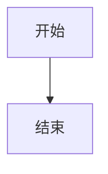

# 会议纪要｜渲染样例

> **会议时间**：2026-01-02 09:00
> **主持人**：张三

---

## 一、结论

1. 第一条结论
2. 第二条结论

### 1.1 分工

| 角色 | 职责 |
|---|---|
| 甲 | 统筹 |
| 乙 | 执行 |

- 要点一
- 要点二


```mermaid
flowchart TD
    A["开始"] --> B["结束"]
```

```text
代码块里的 | 竖线 | 不是表格
```

结束。
